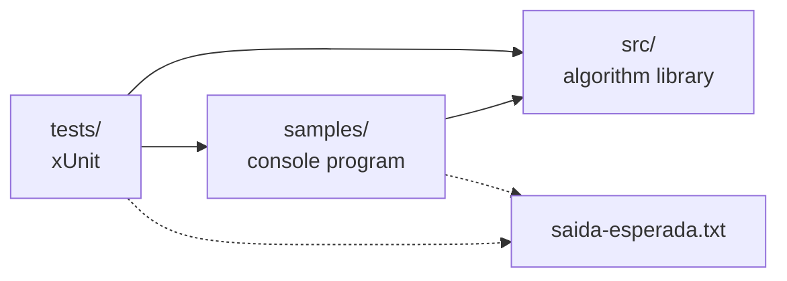

<p align="center">
  
</p>

<p align="center">
  <strong>BR</strong> <a href="README.md">Português</a> |
  <strong>US</strong> <a href="README.en.md">English</a>
</p>

<p align="center">
  <a href="https://github.com/Edinaldosa2/enneal-algoritmos/actions/workflows/ci.yml"></a>
  <a href="LICENSE"></a>
  <a href="https://dotnet.microsoft.com/download/dotnet/8.0"></a>
  
  
  
  <a href="https://www.instagram.com/enneal.it/"></a>
  <a href="https://github.com/Edinaldosa2"></a>
</p>

# enneal-algoritmos

**The complete code of the algorithms that appear in Enneal's Reels: commented in Portuguese, tested, and producing the
same numbers as the videos.**

Saw a Reel from [@enneal.it](https://www.instagram.com/enneal.it/) and asked for the code? It is here. Each algorithm
has a **C# library** with the code explained line by line, a **sample program** you run with one command, and **tests**
that guarantee the numbers are exactly the ones from the Reel.

---

## Algorithms

| Algorithm | Topic | Numbers from the Reel | Sample | Docs |
|-----------|-------|-----------------------|--------|------|
| **N-Queens 8x8** | backtracking, recursion | 876 attempts, 105 backtracks | [`n-rainhas-8x8`](samples/n-rainhas-8x8) | [docs](docs/algoritmos/n-rainhas.md) |
| **N-Queens 4x4 → 8x8** | backtracking, recursion | 26 / 15 / 171 / 42 / 876 attempts | [`n-rainhas-4x4-ate-8x8`](samples/n-rainhas-4x4-ate-8x8) | [docs](docs/algoritmos/n-rainhas.md) |
| **Brute force vs protected login** | password security | 7,392 attempts unprotected; locked after 5 | [`forca-bruta-senha`](samples/forca-bruta-senha) | [docs](docs/algoritmos/forca-bruta-senha.md) |
| **Intruder path** | breadth-first search (BFS), defense in depth | 93 steps with no defenses; 0 paths with 4 layers | [`caminho-do-invasor`](samples/caminho-do-invasor) | [docs](docs/algoritmos/caminho-do-invasor.md) |
| **Sorting race** | Bubble vs Quick vs Merge Sort | 1st Quick (185), 2nd Merge (235), 3rd Bubble (536) | [`corrida-de-ordenacoes`](samples/corrida-de-ordenacoes) | [docs](docs/algoritmos/corrida-de-ordenacoes.md) |
| **Rate limit vs DDoS** | per-IP token bucket | legitimate requests served: 26% → 96%; 886 rejected (429) | [`rate-limit-token-bucket`](samples/rate-limit-token-bucket) | [docs](docs/algoritmos/rate-limit-token-bucket.md) |
| **Dijkstra vs A\*** | shortest path, how GPS finds a route | cost 18; 89 nodes vs 27 nodes (70% fewer) | [`dijkstra-a-estrela`](samples/dijkstra-a-estrela) | [docs](docs/algoritmos/dijkstra-a-estrela.md) |
| **Linear vs binary search** | search in a sorted array | 1,024 items: up to 1,024 vs up to 11; 1 million: 1,000,000 vs 20 | [`busca-linear-vs-binaria`](samples/busca-linear-vs-binaria) | [docs](docs/algoritmos/busca-linear-vs-binaria.md) |
| **Tower of Hanoi** | recursion, 2ⁿ − 1 moves | 3 disks: 7; 4: 15; 6: 63; 64 disks: 18,446,744,073,709,551,615 | [`torre-de-hanoi`](samples/torre-de-hanoi) | [docs](docs/algoritmos/torre-de-hanoi.md) |

### Defensive security

| Sample | Topic | Numbers from the Reel | Sample | Docs |
|--------|-------|-----------------------|--------|------|
| **HTTPS grade** | DNS → TCP → TLS → certificate → HTTP, grade A+ to F | 6 cases in a local lab: no grade, C, T, M, T, A+ | [`nota-do-https`](samples/nota-do-https) | [docs](docs/algoritmos/nota-do-https.md) |
| **Security headers** | HSTS, CSP, nosniff... in ASP.NET Core 8 | F (0/160) → A+ (160/160) in 10 steps | [`cabecalhos-de-seguranca`](samples/cabecalhos-de-seguranca) | [docs](docs/algoritmos/cabecalhos-de-seguranca.md) |
| **Malicious URL or not?** | 30 lexical features + tree model (ONNX) behind a minimal API | 4 of 6 URLs flagged; the "clean" phishing gets through; empty URL → 400 | [`url-maliciosa`](samples/url-maliciosa) | [docs](docs/algoritmos/url-maliciosa.md) |
| **High CVSS ≠ exploited** | CVSS vs EPSS vs KEV triage | exploited at #9, #10, #24 → #1, #2, #3; P1 3, P2 5 | [`triagem-cvss-epss-kev`](samples/triagem-cvss-epss-kev) | [docs](docs/algoritmos/triagem-cvss-epss-kev.md) |
| **Forgotten routes** | audit of your own routes, deny by default | 15 checked: 1 exposed (`/.git/config`) → 0 | [`rotas-esquecidas`](samples/rotas-esquecidas) | [docs](docs/algoritmos/rotas-esquecidas.md) |
| **IDOR: ownership check** | broken access control (OWASP A01) | 4 other people's orders leaked → 0 (403) | [`idor-checagem-de-dono`](samples/idor-checagem-de-dono) | [docs](docs/algoritmos/idor-checagem-de-dono.md) |
| **Constant-time comparison** | `==` vs `FixedTimeEquals` (cost model) | costs 1, 4, 2, 6, 3, 6 → 6 for all; same answer in 6/6 | [`comparacao-tempo-constante`](samples/comparacao-tempo-constante) | [docs](docs/algoritmos/comparacao-tempo-constante.md) |
| **Validating JWT the right way** | JwtBearer in ASP.NET Core 8: loose vs strict | bad tokens accepted: loose 3 of 4, strict 0 of 4 | [`jwt-validacao`](samples/jwt-validacao) | [docs](docs/algoritmos/jwt-validacao.md) |

New algorithms land here as the Reels ship. See the [roadmap](docs/roteiro.md).

---

## What's new in v1.3.0

| Area | Update |
|------|--------|
| **8 defensive-security Reels** | HTTPS grade, security headers, malicious URL, CVSS × EPSS × KEV triage, forgotten routes, IDOR, constant-time comparison and JWT |
| **ASP.NET Core 8** | headers and minimal API with the ASP.NET Core that ships in the SDK (`FrameworkReference`, no NuGet package) |
| **Public data** | queue of 400 CVEs (NVD, FIRST EPSS, CISA KEV) and the notebook's ONNX model, with source and license |
| **Tests** | 375 xUnit tests, including the TLS lab, both end-to-end JWT APIs and URL notebook parity |

### v1.2.0

| Area | Update |
|------|--------|
| **New Reel** | Tower of Hanoi: recursion, 2ⁿ − 1 moves and the exact count for 64 disks with `UInt128` |
| **Tests** | 190 xUnit tests, including Tower of Hanoi properties (2ⁿ − 1 and never a larger disk on a smaller one) |

### v1.1.0

| Area | Update |
|------|--------|
| **Libraries** | each algorithm became a library under `src/`, with no `Console`, returning results and counters |
| **Samples** | one console program per Reel under `samples/`, with the expected output beside it |
| **Tests** | xUnit tests: exact Reel numbers, algorithm properties and each sample's output |
| **New Reels** | Dijkstra vs A\* and linear vs binary search |
| **CI** | GitHub Actions builds with no warnings, runs the tests and every sample on each push |
| **Docs** | one page per algorithm with diagram, complexity, Reel code and exercises |

Full history in the [CHANGELOG](CHANGELOG.md).

---

## Contents

- [Algorithms](#algorithms)
- [What's new in v1.3.0](#whats-new-in-v130)
- [How to run](#how-to-run)
- [Using the libraries](#using-the-libraries)
- [Tests](#tests)
- [Repository layout](#repository-layout)
- [Architecture](#architecture)
- [Educational security](#educational-security)
- [Requirements](#requirements)
- [Documentation](#documentation)
- [Contributing](#contributing)
- [License](#license)
- [Enneal](#enneal)

---

## How to run

1. Install the [.NET 8 SDK](https://dotnet.microsoft.com/download/dotnet/8.0) (free; Windows, Linux or macOS).
2. Download the repository (on GitHub, **Code > Download ZIP**) or clone:

```bash
git clone https://github.com/Edinaldosa2/enneal-algoritmos.git
cd enneal-algoritmos
```

3. Run the sample for the Reel you watched:

```bash
dotnet run --project samples/n-rainhas-8x8
dotnet run --project samples/n-rainhas-4x4-ate-8x8
dotnet run --project samples/forca-bruta-senha
dotnet run --project samples/caminho-do-invasor
dotnet run --project samples/corrida-de-ordenacoes
dotnet run --project samples/rate-limit-token-bucket
dotnet run --project samples/dijkstra-a-estrela
dotnet run --project samples/busca-linear-vs-binaria
dotnet run --project samples/torre-de-hanoi
dotnet run --project samples/nota-do-https
dotnet run --project samples/cabecalhos-de-seguranca
dotnet run --project samples/url-maliciosa
dotnet run --project samples/triagem-cvss-epss-kev
dotnet run --project samples/rotas-esquecidas
dotnet run --project samples/idor-checagem-de-dono
dotnet run --project samples/comparacao-tempo-constante
dotnet run --project samples/jwt-validacao
```

Output of the first one:

```
N-Rainhas 8x8 (backtracking)

Solução (coluna da rainha em cada linha, de cima para baixo):
0 4 7 5 2 6 1 3

tentativas 876 | voltas 105
```

To open everything in Visual Studio, Rider or VS Code, use the `enneal-algoritmos.sln` solution.

---

## Using the libraries

The algorithms do not depend on the console: they return results you can use in your own code.

```csharp
using Enneal.Algoritmos.NRainhas;
using Enneal.Algoritmos.MenorCaminho;

var rainhas = ResolvedorNRainhas.Resolver(8);
Console.WriteLine($"{rainhas.Tentativas} tentativas, {rainhas.Voltas} voltas"); // 876, 105

var rota = BuscaDeRota.AEstrela(MapaDaCidade.DoReel);
Console.WriteLine($"custo {rota.Custo}, {rota.NosExplorados} nós");            // 18, 27
```

Each page under [`docs/algoritmos/`](docs/algoritmos) has usage examples for the matching library.

---

## Tests

```bash
dotnet test
```

| Group | What it checks |
|-------|----------------|
| Reel numbers | every counter shown in the videos (876/105, 7,392, 93/48, 185/235/536, 26%/96%/886, 18/89/27, 7/10, 613/10, 1,024/11, 20, 7/15/63, 2⁶⁴ − 1, and the grades, scores, probabilities, positions, costs and statuses from the 8 security Reels) |
| Properties | N-Queens solutions are valid (and 8x8 has 92), sorts match .NET's `Order()`, Bubble swaps = inversions, A\* finds the same cost as Dijkstra, binary search never exceeds ⌊log₂ n⌋ + 1 comparisons, Tower of Hanoi always does 2ⁿ − 1 moves and never places a larger disk on a smaller one |
| Defenses | login accepts the right password, locks after 5 failures, lockout expires in 15 minutes, each account has its own salt; the token bucket respects burst and rate; ownership check never leaks someone else's order; deny-by-default does not expose a route outside the allow list; the triaged queue puts every KEV CVE before the others; every grade ceiling is applied; the early-exit loop leaks the prefix and `FixedTimeEquals` always costs the length; the strict API rejects unsigned, edited, wrong-audience or expired tokens |
| Notebook parity | triage matches risk and tier for the 400 CVEs from the notebook; the 30 URL features and probability match the 9 cases saved by ONNX Runtime |
| Sample output | each program under `samples/` is run and compared, character by character, with `saida-esperada.txt` |

---

## Repository layout

```
enneal-algoritmos/
├── src/                        Libraries: the pure algorithm, commented
│   ├── Enneal.Algoritmos.NRainhas/
│   ├── Enneal.Algoritmos.ForcaBruta/
│   ├── Enneal.Algoritmos.CaminhoInvasor/
│   ├── Enneal.Algoritmos.Ordenacoes/
│   ├── Enneal.Algoritmos.RateLimit/
│   ├── Enneal.Algoritmos.MenorCaminho/
│   ├── Enneal.Algoritmos.Busca/
│   ├── Enneal.Algoritmos.TorreHanoi/
│   ├── Enneal.Algoritmos.NotaTls/
│   ├── Enneal.Algoritmos.CabecalhosSeguranca/
│   ├── Enneal.Algoritmos.UrlMaliciosa/
│   ├── Enneal.Algoritmos.TriagemVulnerabilidades/
│   ├── Enneal.Algoritmos.RotasEsquecidas/
│   ├── Enneal.Algoritmos.ControleDeAcesso/
│   ├── Enneal.Algoritmos.ComparacaoSegura/
│   └── Enneal.Algoritmos.ValidacaoJwt/
├── samples/                    One console program per Reel (+ saida-esperada.txt)
├── tests/                      Enneal.Algoritmos.Tests (xUnit)
├── docs/                       Architecture, educational security, roadmap and one page per algorithm
├── img/                        Banner
├── util/                       Verification and GitHub setup scripts
├── .github/                    CI, issue and pull request templates
├── enneal-algoritmos.sln
├── Directory.Build.props       Shared settings (.NET 8, C# 12, Nullable)
└── Directory.Packages.props    Central NuGet package versions
```

---

## Architecture



Each sample calls the library and prints the Reel numbers; the tests check the library and the sample output.
Details in [docs/arquitetura.md](docs/arquitetura.md).

---

## Educational security

The security samples teach **defense**: toy simulations, audits of your own system and local labs.

| Rule | How it works |
|------|--------------|
| Nothing leaves the machine | no sample accesses the internet, reads password files or another system; the only sockets (TLS, the URL minimal API and the JWT APIs) stay on `127.0.0.1`, inside the same process |
| Toy target | the "target" is a variable, a text map, a route table or a list of objects in the same program |
| Fictional names | `.example`/`.invalid` hosts and documentation IPs (RFC 2606 and RFC 5737); invented people and documents |
| Minimal scope | brute force only accepts a 4-digit PIN and only "attacks" a login created in the same process; tokens and keys are demo values |
| Defense first | every security sample shows the defense working and has a **How to defend** section |

See [docs/seguranca-didatica.md](docs/seguranca-didatica.md) and [SECURITY.md](SECURITY.md).

---

## Requirements

| Component | Version |
|-----------|---------|
| SDK | [.NET 8](https://dotnet.microsoft.com/download/dotnet/8.0) or newer |
| OS | Windows, Linux or macOS |
| Editor (optional) | Visual Studio 2022, Rider or VS Code with C# Dev Kit |

No external packages in the libraries and samples, with one exception: the JWT sample uses Microsoft's official
`Microsoft.AspNetCore.Authentication.JwtBearer` package (configuring it correctly is the point of that Reel). The
headers, URL and JWT samples use ASP.NET Core 8, which ships with the .NET 8 SDK (`FrameworkReference`). Tests use
xUnit. Packages are downloaded by `dotnet build`/`dotnet test`.

---

## Documentation

| Document | Description |
|----------|-------------|
| [docs/arquitetura.md](docs/arquitetura.md) | projects, decisions and extension points |
| [docs/seguranca-didatica.md](docs/seguranca-didatica.md) | rules for the security samples |
| [docs/roteiro.md](docs/roteiro.md) | what is done and what comes next |
| [docs/algoritmos/](docs/algoritmos) | one page per algorithm: diagram, complexity, Reel code and exercises |
| [CHANGELOG.md](CHANGELOG.md) | version history |
| [CONTRIBUTING.md](CONTRIBUTING.md) | how to contribute and how to add an algorithm |

---

## Contributing

Found a bug, have a question or a Reel idea? Open an [issue](https://github.com/Edinaldosa2/enneal-algoritmos/issues).
To send code, read [CONTRIBUTING.md](CONTRIBUTING.md): it explains the folder layout and how to run the full check.

---

## License

MIT. See [LICENSE](LICENSE). You may use, study, modify and share, keeping the copyright notice.

---

## Enneal

- Instagram: [@enneal.it](https://www.instagram.com/enneal.it/)
- Website: [enneal.com.br](https://enneal.com.br)
- Author: [Edinaldosa2](https://github.com/Edinaldosa2)

Liked it? Leave a ⭐ on the repository and share the Reel with someone learning to code.
