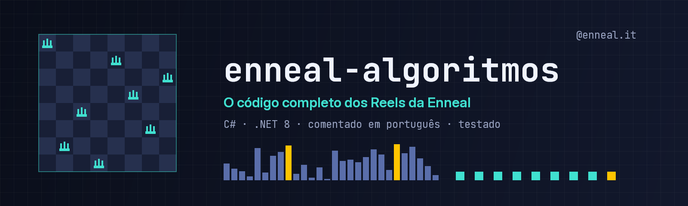

<p align="center">
  
</p>

<p align="center">
  <strong>BR</strong> <a href="README.md">Português</a> |
  <strong>US</strong> <a href="README.en.md">English</a>
</p>

<p align="center">
  <a href="https://github.com/Edinaldosa2/enneal-algoritmos/actions/workflows/ci.yml"></a>
  <a href="LICENSE"></a>
  <a href="https://dotnet.microsoft.com/download/dotnet/8.0"></a>
  
  
  
  <a href="https://www.instagram.com/enneal.it/"></a>
  <a href="https://github.com/Edinaldosa2"></a>
</p>

# enneal-algoritmos

**The complete code of the algorithms shown in Enneal's Instagram Reels: commented, tested, and producing the exact
same numbers as the videos.**

Each algorithm has a **C# library** with the code explained line by line, a **sample program** you run with one
command, and **tests** that guarantee the numbers match the Reel. The code, comments and docs are in Portuguese
(the Reels are in Portuguese); identifiers are easy to follow and this page summarizes everything in English.

---

## Algorithms

| Algorithm | Topic | Numbers from the Reel | Sample |
|-----------|-------|-----------------------|--------|
| **N-Queens 8x8** | backtracking, recursion | 876 attempts, 105 backtracks | [`n-rainhas-8x8`](samples/n-rainhas-8x8) |
| **N-Queens 4x4 → 8x8** | backtracking, recursion | 26 / 15 / 171 / 42 / 876 attempts | [`n-rainhas-4x4-ate-8x8`](samples/n-rainhas-4x4-ate-8x8) |
| **Brute force vs protected login** | password security | 7,392 attempts unprotected; locked after 5 | [`forca-bruta-senha`](samples/forca-bruta-senha) |
| **Intruder path** | breadth-first search, defense in depth | 93 steps with no defenses; 0 paths with 4 layers | [`caminho-do-invasor`](samples/caminho-do-invasor) |
| **Sorting race** | Bubble vs Quick vs Merge Sort | 1st Quick (185), 2nd Merge (235), 3rd Bubble (536) | [`corrida-de-ordenacoes`](samples/corrida-de-ordenacoes) |
| **Rate limit vs DDoS** | per-IP token bucket | legitimate requests served: 26% → 96%; 886 rejected (429) | [`rate-limit-token-bucket`](samples/rate-limit-token-bucket) |
| **Dijkstra vs A\*** | shortest path (how GPS finds a route) | cost 18; 89 vs 27 nodes explored (70% fewer) | [`dijkstra-a-estrela`](samples/dijkstra-a-estrela) |
| **Linear vs binary search** | searching a sorted array | 1,024 items: up to 1,024 vs up to 11; 1 million: 1,000,000 vs 20 | [`busca-linear-vs-binaria`](samples/busca-linear-vs-binaria) |

Detailed pages (diagram, complexity, the code from the Reel, exercises) live in [`docs/algoritmos/`](docs/algoritmos).

---

## Quick start

1. Install the [.NET 8 SDK](https://dotnet.microsoft.com/download/dotnet/8.0) (free; Windows, Linux or macOS).
2. Clone and run any sample:

```bash
git clone https://github.com/Edinaldosa2/enneal-algoritmos.git
cd enneal-algoritmos
dotnet run --project samples/dijkstra-a-estrela
```

3. Run the tests:

```bash
dotnet test
```

## Using the libraries

```csharp
using Enneal.Algoritmos.NRainhas;
using Enneal.Algoritmos.MenorCaminho;

var queens = ResolvedorNRainhas.Resolver(8);
Console.WriteLine($"{queens.Tentativas} attempts, {queens.Voltas} backtracks"); // 876, 105

var route = BuscaDeRota.AEstrela(MapaDaCidade.DoReel);
Console.WriteLine($"cost {route.Custo}, {route.NosExplorados} nodes");          // 18, 27
```

---

## Repository layout

```
enneal-algoritmos/
├── src/        Libraries: the pure algorithms, commented (no Console)
├── samples/    One console program per Reel, with saida-esperada.txt (expected output)
├── tests/      Enneal.Algoritmos.Tests (xUnit)
├── docs/       Architecture, security rules, roadmap, one page per algorithm
├── img/        Banner
├── util/       Verification and GitHub setup scripts
└── .github/    CI, issue and pull request templates
```

## Security topics are defensive toys

The security samples (brute force, intruder path, rate limit) are **toy simulations that teach defense**. Nothing
leaves the process: no network, no real passwords, no third-party systems. The brute-force library only accepts a
4-digit PIN and only "attacks" a `LoginProtegido` created in the same process. See
[docs/seguranca-didatica.md](docs/seguranca-didatica.md) and [SECURITY.md](SECURITY.md).

## Requirements

| Component | Version |
|-----------|---------|
| SDK | .NET 8 or newer |
| OS | Windows, Linux or macOS |

No external packages in the libraries or samples; tests use xUnit.

## Contributing

Issues and pull requests are welcome. See [CONTRIBUTING.md](CONTRIBUTING.md) (Portuguese).

## License

MIT. See [LICENSE](LICENSE).

## Enneal

- Instagram: [@enneal.it](https://www.instagram.com/enneal.it/)
- Website: [enneal.com.br](https://enneal.com.br)
- Author: [Edinaldosa2](https://github.com/Edinaldosa2)
