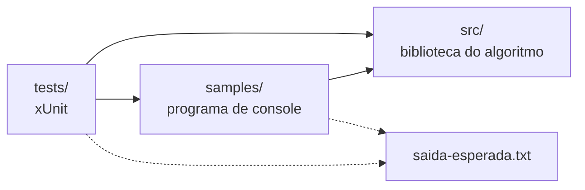

<p align="center">
  
</p>

<p align="center">
  <strong>BR</strong> <a href="README.md">Português</a> |
  <strong>US</strong> <a href="README.en.md">English</a>
</p>

<p align="center">
  <a href="https://github.com/Edinaldosa2/enneal-algoritmos/actions/workflows/ci.yml"></a>
  <a href="LICENSE"></a>
  <a href="https://dotnet.microsoft.com/download/dotnet/8.0"></a>
  
  
  
  <a href="https://www.instagram.com/enneal.it/"></a>
  <a href="https://github.com/Edinaldosa2"></a>
</p>

# enneal-algoritmos

**O código completo dos algoritmos que aparecem nos Reels da Enneal: comentado em português, testado e com os
mesmos números do vídeo.**

Viu um Reel da [@enneal.it](https://www.instagram.com/enneal.it/) e comentou pedindo o código? É aqui. Cada algoritmo
tem uma **biblioteca C#** com o código explicado linha por linha, um **programa de exemplo** que você roda com um
comando e **testes** que garantem que os números são exatamente os do Reel.

---

## Algoritmos

| Algoritmo | Tema | Números do Reel | Exemplo | Explicação |
|-----------|------|-----------------|---------|------------|
| **N-Rainhas 8x8** | backtracking, recursão | 876 tentativas, 105 voltas | [`n-rainhas-8x8`](samples/n-rainhas-8x8) | [docs](docs/algoritmos/n-rainhas.md) |
| **N-Rainhas 4x4 → 8x8** | backtracking, recursão | 26 / 15 / 171 / 42 / 876 tentativas | [`n-rainhas-4x4-ate-8x8`](samples/n-rainhas-4x4-ate-8x8) | [docs](docs/algoritmos/n-rainhas.md) |
| **Força bruta x login protegido** | segurança de senhas | 7.392 tentativas sem proteção; bloqueado após 5 | [`forca-bruta-senha`](samples/forca-bruta-senha) | [docs](docs/algoritmos/forca-bruta-senha.md) |
| **Caminho do invasor** | busca em largura (BFS), defesa em camadas | 93 passos sem defesas; 0 caminhos com 4 camadas | [`caminho-do-invasor`](samples/caminho-do-invasor) | [docs](docs/algoritmos/caminho-do-invasor.md) |
| **Corrida de ordenações** | Bubble x Quick x Merge Sort | 1º Quick (185), 2º Merge (235), 3º Bubble (536) | [`corrida-de-ordenacoes`](samples/corrida-de-ordenacoes) | [docs](docs/algoritmos/corrida-de-ordenacoes.md) |
| **Rate limit x DDoS** | token bucket por IP | legítimos atendidos: 26% → 96%; 886 bloqueadas (429) | [`rate-limit-token-bucket`](samples/rate-limit-token-bucket) | [docs](docs/algoritmos/rate-limit-token-bucket.md) |
| **Dijkstra x A\*** | menor caminho, como o GPS acha a rota | custo 18; 89 nós x 27 nós (70% menos) | [`dijkstra-a-estrela`](samples/dijkstra-a-estrela) | [docs](docs/algoritmos/dijkstra-a-estrela.md) |
| **Busca linear x binária** | busca em vetor ordenado | 1.024 itens: até 1.024 x até 11; 1 milhão: 1.000.000 x 20 | [`busca-linear-vs-binaria`](samples/busca-linear-vs-binaria) | [docs](docs/algoritmos/busca-linear-vs-binaria.md) |
| **Torre de Hanói** | recursão, 2ⁿ − 1 movimentos | 3 discos: 7; 4: 15; 6: 63; 64 discos: 18.446.744.073.709.551.615 | [`torre-de-hanoi`](samples/torre-de-hanoi) | [docs](docs/algoritmos/torre-de-hanoi.md) |

### Segurança defensiva

| Exemplo | Tema | Números do Reel | Exemplo | Explicação |
|---------|------|-----------------|---------|------------|
| **Nota do HTTPS** | DNS → TCP → TLS → certificado → HTTP, nota A+ a F | 6 casos em laboratório local: sem nota, C, T, M, T, A+ | [`nota-do-https`](samples/nota-do-https) | [docs](docs/algoritmos/nota-do-https.md) |
| **Cabeçalhos de segurança** | HSTS, CSP, nosniff... no ASP.NET Core 8 | F (0/160) → A+ (160/160) em 10 fases | [`cabecalhos-de-seguranca`](samples/cabecalhos-de-seguranca) | [docs](docs/algoritmos/cabecalhos-de-seguranca.md) |
| **URL maliciosa ou não?** | 30 pistas léxicas + modelo de árvores (ONNX) numa minimal API | 4 de 6 URLs marcadas; o phishing "limpo" passa; URL vazia → 400 | [`url-maliciosa`](samples/url-maliciosa) | [docs](docs/algoritmos/url-maliciosa.md) |
| **CVSS alto ≠ explorada** | triagem CVSS x EPSS x KEV | exploradas em #9, #10, #24 → #1, #2, #3; P1 3, P2 5 | [`triagem-cvss-epss-kev`](samples/triagem-cvss-epss-kev) | [docs](docs/algoritmos/triagem-cvss-epss-kev.md) |
| **Rotas esquecidas** | auditoria das suas rotas, negar por padrão | 15 conferidas: 1 exposta (`/.git/config`) → 0 | [`rotas-esquecidas`](samples/rotas-esquecidas) | [docs](docs/algoritmos/rotas-esquecidas.md) |
| **IDOR: checagem de dono** | controle de acesso quebrado (OWASP A01) | 4 pedidos de outras pessoas vazados → 0 (403) | [`idor-checagem-de-dono`](samples/idor-checagem-de-dono) | [docs](docs/algoritmos/idor-checagem-de-dono.md) |
| **Comparação em tempo constante** | `==` x `FixedTimeEquals` (modelo de custo) | custos 1, 4, 2, 6, 3, 6 → 6 em todos; mesma resposta em 6/6 | [`comparacao-tempo-constante`](samples/comparacao-tempo-constante) | [docs](docs/algoritmos/comparacao-tempo-constante.md) |
| **JWT do jeito certo** | JwtBearer no ASP.NET Core 8: frouxo x certo | tokens ruins aceitos: frouxa 3 de 4, certa 0 de 4 | [`jwt-validacao`](samples/jwt-validacao) | [docs](docs/algoritmos/jwt-validacao.md) |

Novos algoritmos entram aqui conforme os Reels forem saindo. Veja o [roteiro](docs/roteiro.md).

---

## Novidades na v1.3.0

| Área | Atualização |
|------|-------------|
| **8 Reels de segurança defensiva** | nota do HTTPS, cabeçalhos de segurança, URL maliciosa, triagem CVSS x EPSS x KEV, rotas esquecidas, IDOR, comparação em tempo constante e JWT |
| **ASP.NET Core 8** | cabeçalhos e minimal API com o ASP.NET Core que já vem no SDK (`FrameworkReference`, sem pacote NuGet) |
| **Dados públicos** | fila de 400 CVEs (NVD, FIRST EPSS, CISA KEV) e o modelo ONNX do notebook, com fonte e licença |
| **Testes** | 375 testes xUnit, incluindo o laboratório TLS e as duas APIs JWT de ponta a ponta e a paridade com o notebook da URL |

### v1.2.0

| Área | Atualização |
|------|-------------|
| **Novo Reel** | Torre de Hanói: recursão, 2ⁿ − 1 movimentos e a conta exata dos 64 discos com `UInt128` |
| **Testes** | 190 testes xUnit, incluindo propriedades da Torre de Hanói (2ⁿ − 1 e nunca um disco maior sobre um menor) |

### v1.1.0

| Área | Atualização |
|------|-------------|
| **Bibliotecas** | cada algoritmo virou uma biblioteca em `src/`, sem `Console`, devolvendo resultados e contadores |
| **Exemplos** | um programa de console por Reel em `samples/`, com a saída esperada ao lado |
| **Testes** | testes xUnit: números exatos dos Reels, propriedades dos algoritmos e saída de cada exemplo |
| **Novos Reels** | Dijkstra x A\* e busca linear x binária |
| **CI** | GitHub Actions compila sem avisos, roda os testes e todos os exemplos a cada push |
| **Documentação** | uma página por algoritmo com diagrama, complexidade, código do Reel e exercícios |

Histórico completo no [CHANGELOG](CHANGELOG.md).

---

## Sumário

- [Algoritmos](#algoritmos)
- [Novidades na v1.3.0](#novidades-na-v130)
- [Como rodar](#como-rodar)
- [Usando as bibliotecas](#usando-as-bibliotecas)
- [Testes](#testes)
- [Estrutura do repositório](#estrutura-do-repositório)
- [Arquitetura](#arquitetura)
- [Segurança didática](#segurança-didática)
- [Requisitos](#requisitos)
- [Documentação](#documentação)
- [Contribuindo](#contribuindo)
- [Licença](#licença)
- [Enneal](#enneal)

---

## Como rodar

1. Instale o [.NET 8 SDK](https://dotnet.microsoft.com/download/dotnet/8.0) (grátis, Windows, Linux ou macOS).
2. Baixe o repositório (no GitHub, **Code > Download ZIP**) ou clone:

```bash
git clone https://github.com/Edinaldosa2/enneal-algoritmos.git
cd enneal-algoritmos
```

3. Rode o exemplo do Reel que você viu:

```bash
dotnet run --project samples/n-rainhas-8x8
dotnet run --project samples/n-rainhas-4x4-ate-8x8
dotnet run --project samples/forca-bruta-senha
dotnet run --project samples/caminho-do-invasor
dotnet run --project samples/corrida-de-ordenacoes
dotnet run --project samples/rate-limit-token-bucket
dotnet run --project samples/dijkstra-a-estrela
dotnet run --project samples/busca-linear-vs-binaria
dotnet run --project samples/torre-de-hanoi
dotnet run --project samples/nota-do-https
dotnet run --project samples/cabecalhos-de-seguranca
dotnet run --project samples/url-maliciosa
dotnet run --project samples/triagem-cvss-epss-kev
dotnet run --project samples/rotas-esquecidas
dotnet run --project samples/idor-checagem-de-dono
dotnet run --project samples/comparacao-tempo-constante
dotnet run --project samples/jwt-validacao
```

Saída do primeiro:

```
N-Rainhas 8x8 (backtracking)

Solução (coluna da rainha em cada linha, de cima para baixo):
0 4 7 5 2 6 1 3

tentativas 876 | voltas 105
```

Para abrir tudo no Visual Studio, Rider ou VS Code, use a solução `enneal-algoritmos.sln`.

---

## Usando as bibliotecas

Os algoritmos não dependem do console: devolvem resultados que você pode usar no seu próprio código.

```csharp
using Enneal.Algoritmos.NRainhas;
using Enneal.Algoritmos.MenorCaminho;

var rainhas = ResolvedorNRainhas.Resolver(8);
Console.WriteLine($"{rainhas.Tentativas} tentativas, {rainhas.Voltas} voltas"); // 876, 105

var rota = BuscaDeRota.AEstrela(MapaDaCidade.DoReel);
Console.WriteLine($"custo {rota.Custo}, {rota.NosExplorados} nós");            // 18, 27
```

Cada página em [`docs/algoritmos/`](docs/algoritmos) tem exemplos de uso da biblioteca correspondente.

---

## Testes

```bash
dotnet test
```

| Grupo | O que confere |
|-------|---------------|
| Números dos Reels | cada contador mostrado nos vídeos (876/105, 7.392, 93/48, 185/235/536, 26%/96%/886, 18/89/27, 7/10, 613/10, 1.024/11, 20, 7/15/63, 2⁶⁴ − 1, e as notas, pontos, probabilidades, posições, custos e status dos 8 Reels de segurança) |
| Propriedades | soluções das N rainhas são válidas (e o 8x8 tem 92), as ordenações batem com o `Order()` do .NET, trocas do Bubble = inversões, A\* acha o mesmo custo que Dijkstra, binária nunca passa de ⌊log₂ n⌋ + 1 comparações, a Torre de Hanói faz sempre 2ⁿ − 1 movimentos e nunca põe um disco maior sobre um menor |
| Defesas | login aceita a senha certa, bloqueia após 5 falhas, o bloqueio vence em 15 minutos, cada conta tem o seu salt; o token bucket respeita rajada e taxa; a checagem de dono nunca vaza pedido de outra pessoa; negar por padrão não expõe rota fora da lista; a fila triada põe toda CVE da KEV antes das outras; cada teto de nota é aplicado; o laço que sai cedo vaza o prefixo e o `FixedTimeEquals` custa sempre o tamanho; a API certa recusa token sem assinatura, editado, de outra audience ou vencido |
| Paridade com os notebooks | a triagem bate com o risco e a faixa das 400 CVEs do notebook; as 30 pistas e a probabilidade da URL batem com os 9 casos salvos pelo ONNX Runtime |
| Saída dos exemplos | cada programa de `samples/` é executado e comparado, caractere por caractere, com o `saida-esperada.txt` |

---

## Estrutura do repositório

```
enneal-algoritmos/
├── src/                        Bibliotecas: o algoritmo puro, comentado
│   ├── Enneal.Algoritmos.NRainhas/
│   ├── Enneal.Algoritmos.ForcaBruta/
│   ├── Enneal.Algoritmos.CaminhoInvasor/
│   ├── Enneal.Algoritmos.Ordenacoes/
│   ├── Enneal.Algoritmos.RateLimit/
│   ├── Enneal.Algoritmos.MenorCaminho/
│   ├── Enneal.Algoritmos.Busca/
│   ├── Enneal.Algoritmos.TorreHanoi/
│   ├── Enneal.Algoritmos.NotaTls/
│   ├── Enneal.Algoritmos.CabecalhosSeguranca/
│   ├── Enneal.Algoritmos.UrlMaliciosa/
│   ├── Enneal.Algoritmos.TriagemVulnerabilidades/
│   ├── Enneal.Algoritmos.RotasEsquecidas/
│   ├── Enneal.Algoritmos.ControleDeAcesso/
│   ├── Enneal.Algoritmos.ComparacaoSegura/
│   └── Enneal.Algoritmos.ValidacaoJwt/
├── samples/                    Um programa de console por Reel (+ saida-esperada.txt)
├── tests/                      Enneal.Algoritmos.Tests (xUnit)
├── docs/                       Arquitetura, segurança didática, roteiro e uma página por algoritmo
├── img/                        Banner
├── util/                       Scripts de verificação e de configuração do GitHub
├── .github/                    CI, modelos de issue e de pull request
├── enneal-algoritmos.sln
├── Directory.Build.props       Configurações comuns (.NET 8, C# 12, Nullable)
└── Directory.Packages.props    Versões centrais dos pacotes NuGet
```

---

## Arquitetura



Cada exemplo chama a biblioteca e imprime os números do Reel; os testes conferem a biblioteca e a saída do exemplo.
Detalhes em [docs/arquitetura.md](docs/arquitetura.md).

---

## Segurança didática

Os exemplos de segurança ensinam **defesa**: simulações de brinquedo, auditorias do seu próprio sistema e laboratórios
locais.

| Regra | Como funciona |
|-------|---------------|
| Nada sai da máquina | nenhum exemplo acessa a internet, lê arquivos de senha ou outro sistema; os únicos sockets (TLS, a minimal API da URL e as APIs do JWT) ficam em `127.0.0.1`, dentro do próprio processo |
| Alvo de brinquedo | o "alvo" é uma variável, um mapa em texto, uma tabela de rotas ou uma lista de objetos do próprio programa |
| Nomes fictícios | hosts `.example`/`.invalid` e IPs de documentação (RFC 2606 e RFC 5737); pessoas e documentos inventados |
| Escopo mínimo | a força bruta só aceita PIN de 4 dígitos e só "ataca" um login criado no mesmo processo; tokens e chaves são de demonstração |
| Defesa primeiro | todo exemplo de segurança mostra a defesa funcionando e tem a seção **Como se defender** |

Veja [docs/seguranca-didatica.md](docs/seguranca-didatica.md) e [SECURITY.md](SECURITY.md).

---

## Requisitos

| Componente | Versão |
|------------|--------|
| SDK | [.NET 8](https://dotnet.microsoft.com/download/dotnet/8.0) ou mais novo |
| Sistema | Windows, Linux ou macOS |
| Editor (opcional) | Visual Studio 2022, Rider ou VS Code com C# Dev Kit |

Nenhum pacote externo nas bibliotecas e nos exemplos, com uma exceção: o exemplo de JWT usa o pacote oficial da
Microsoft `Microsoft.AspNetCore.Authentication.JwtBearer` (configurá-lo direito é o assunto do Reel). Os exemplos de
cabeçalhos, URL e JWT usam o ASP.NET Core 8, que já vem no .NET 8 SDK (`FrameworkReference`). Os testes usam xUnit.
Os pacotes são baixados pelo `dotnet build`/`dotnet test`.

---

## Documentação

| Documento | Descrição |
|-----------|-----------|
| [docs/arquitetura.md](docs/arquitetura.md) | projetos, decisões e pontos de extensão |
| [docs/seguranca-didatica.md](docs/seguranca-didatica.md) | regras dos exemplos de segurança |
| [docs/roteiro.md](docs/roteiro.md) | o que já foi feito e o que vem por aí |
| [docs/algoritmos/](docs/algoritmos) | uma página por algoritmo: diagrama, complexidade, código do Reel e exercícios |
| [CHANGELOG.md](CHANGELOG.md) | histórico de versões |
| [CONTRIBUTING.md](CONTRIBUTING.md) | como contribuir e como adicionar um algoritmo |

---

## Contribuindo

Achou um erro, tem uma dúvida ou uma ideia de Reel? Abra uma [issue](https://github.com/Edinaldosa2/enneal-algoritmos/issues).
Para mandar código, leia o [CONTRIBUTING.md](CONTRIBUTING.md): ele explica o padrão das pastas e como rodar a
verificação completa.

---

## Licença

MIT. Veja [LICENSE](LICENSE). Pode usar, estudar, modificar e compartilhar, mantendo o aviso de copyright.

---

## Enneal

- Instagram: [@enneal.it](https://www.instagram.com/enneal.it/)
- Site: [enneal.com.br](https://enneal.com.br)
- Autor: [Edinaldosa2](https://github.com/Edinaldosa2)

Gostou? Deixe uma ⭐ no repositório e mande o Reel para quem está aprendendo a programar.
