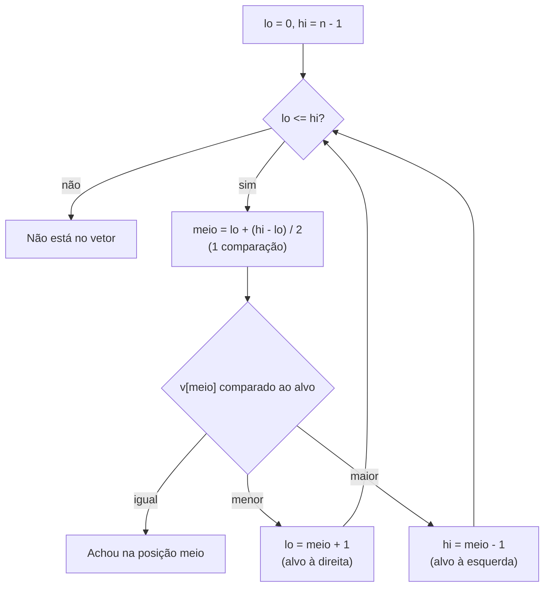

# Busca linear x busca binária

> Reel: (link em breve)

As duas buscas procuram o **mesmo número** no **mesmo vetor ordenado** de 1.024 itens. A linear olha item por item;
a binária olha o meio e joga fora a metade onde o número não pode estar. Depois, a mesma conta para **1 milhão**.

| | |
|---|---|
| Biblioteca | [`src/Enneal.Algoritmos.Busca`](../../src/Enneal.Algoritmos.Busca) |
| Exemplo | [`samples/busca-linear-vs-binaria`](../../samples/busca-linear-vs-binaria) |
| Testes | [`BuscaTests.cs`](../../tests/Enneal.Algoritmos.Tests/Algoritmos/BuscaTests.cs) |

---

## Como funciona

- **Linear:** compara o alvo com o 1º item, o 2º, o 3º... até achar. Funciona em qualquer vetor.
- **Binária:** só funciona em vetor **ordenado**. Compara com o item do meio: se o alvo é maior, descarta a metade
  da esquerda; se é menor, a da direita. Cada comparação corta o problema pela metade.



O vetor do Reel começa entre 3 e 7 e cada item é o anterior + 1 a 4 (semente fixa 2026): ordenado e sem repetidos.

## O código do Reel

```csharp
int Binaria(int[] v, int alvo) {
    int lo = 0, hi = v.Length - 1;
    while (lo <= hi) {
        int meio = lo + (hi - lo) / 2;
        int c = Compara(v[meio], alvo);
        if (c == 0) return meio;
        if (c < 0) lo = meio + 1;    // alvo à direita
        else hi = meio - 1;          // alvo à esquerda
    }
    return -1;
}
```

`lo + (hi - lo) / 2` em vez de `(lo + hi) / 2` evita estouro de inteiro em vetores enormes.

## Complexidade

| Busca | Melhor caso | Pior caso | Precisa de vetor ordenado? |
|-------|-------------|-----------|----------------------------|
| Linear | 1 comparação | n comparações, O(n) | não |
| Binária | 1 comparação | ⌊log₂ n⌋ + 1 comparações, O(log n) | **sim** |

## Números do Reel

| Rodada | Alvo | Posição | Linear | Binária |
|--------|-----:|--------:|-------:|--------:|
| 1 | 19 | 6 | 7 | 10 |
| 2 | 1.565 | 612 | 613 | 10 |
| 3 (último item) | 2.562 | 1.023 | 1.024 | 11 |

Na rodada 1 a linear ganha: o alvo está logo no começo. Mas o pior caso dela cresce junto com o vetor:

| Itens | Linear (pior caso) | Binária (pior caso) | Binária (média, achando cada item) |
|------:|-------------------:|--------------------:|-----------------------------------:|
| 1.024 | 1.024 | 11 | 9,01 |
| 1.000.000 | 1.000.000 | **20** | 18,95 |

## Usando a biblioteca

```csharp
using Enneal.Algoritmos.Busca;

int[] v = VetorOrdenado.Gerar(1024);
var linear = Buscas.Linear(v, 1565);   // posição 612, 613 comparações
var binaria = Buscas.Binaria(v, 1565); // posição 612, 10 comparações
```

## Para praticar

- Teste a binária num vetor **fora de ordem** e veja ela "não achar" números que estão lá.
- Conte quantas comparações a linear faz, em média, para achar cada item (dica: (n + 1) / 2).
- Compare com `Array.BinarySearch` do .NET (os testes fazem isso).
