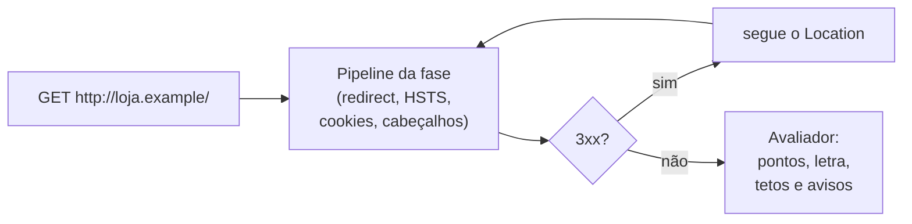

# Do F ao A+: um cabeçalho de segurança por vez

> Reel: (link em breve)

Cabeçalhos HTTP de segurança dizem ao navegador o que ele **não** deve fazer com o seu site: abrir em HTTP, adivinhar
o tipo do arquivo, deixar outro site embutir a página num iframe, vazar o endereço completo para outros sites, usar
câmera e microfone sem motivo, rodar script injetado. Uma loja **ASP.NET Core 8** (`loja.example`) começa com nota
**F** e ganha um cabeçalho por fase, até o **A+**.

> **Sem servidor e sem rede.** Cada fase monta o pipeline de verdade do ASP.NET Core e o GET roda direto nele, em
> memória (`DefaultHttpContext`). Veja [seguranca-didatica.md](../seguranca-didatica.md).

| | |
|---|---|
| Biblioteca | [`src/Enneal.Algoritmos.CabecalhosSeguranca`](../../src/Enneal.Algoritmos.CabecalhosSeguranca) |
| Exemplo | [`samples/cabecalhos-de-seguranca`](../../samples/cabecalhos-de-seguranca) |
| Testes | [`CabecalhosSegurancaTests.cs`](../../tests/Enneal.Algoritmos.Tests/Algoritmos/CabecalhosSegurancaTests.cs) |
| Notebook | [HTTP security headers: A to F grades + .NET fix](https://www.kaggle.com/code/edinaldos/http-security-headers-a-to-f-grades-net-fix) |

---

## A régua (160 pontos)

| Item | Pontos |
|------|-------:|
| Responde em HTTPS | 30 |
| HSTS (`Strict-Transport-Security`) | 25 |
| CSP válida | 25 |
| `X-Frame-Options` ou `frame-ancestors` na CSP | 20 |
| `X-Content-Type-Options: nosniff` | 20 |
| `Referrer-Policy` válida | 20 |
| `Permissions-Policy` válida | 20 |

Letra pela porcentagem: **A+** ≥ 95%, **A** ≥ 75%, **B** ≥ 60%, **C** ≥ 50%, **D** ≥ 29%, **E** ≥ 14%, **F** abaixo.
**Tetos:** CSP com `'unsafe-inline'` (ou `'unsafe-eval'`) no script, HSTS de menos de 1 ano ou
`Referrer-Policy: unsafe-url` impedem o A+. Cookies sem `Secure` ou sem `HttpOnly` viram **avisos**.

As regras seguem o notebook (no estilo do securityheaders.com); não é a nota oficial de nenhum serviço.

## Como funciona



## O código da loja

```csharp
var app = b.Build();
if (fase >= 1) app.UseHttpsRedirection(); // http -> https (307)
if (fase >= 2) app.UseHsts();             // Strict-Transport-Security: 365 dias + subdomínios
if (fase >= 7) app.UseCookiePolicy();     // cookies com Secure, HttpOnly e SameSite=Lax
app.Use((ctx, next) => Cabecalhos(ctx, next, fase));

// no middleware de cabeçalhos:
if (fase >= 3) h.XContentTypeOptions = "nosniff";
if (fase >= 4) h.XFrameOptions = "DENY";
if (fase >= 5) h["Referrer-Policy"] = "strict-origin-when-cross-origin";
if (fase >= 6) h["Permissions-Policy"] = "camera=(), geolocation=(), microphone=(), payment=()";
// fase 10: script-src 'nonce-{nonce}' 'strict-dynamic' (nonce novo a cada resposta)
```

## Complexidade

| Medida | Valor |
|--------|-------|
| Custo por resposta | O(número de cabeçalhos): alguns bytes e nenhuma consulta extra |
| Avaliação | O(tamanho dos cabeçalhos) |

## Números do Reel

| Fase | O que entra | Pontos | Nota | Avisos |
|-----:|-------------|-------:|------|-------:|
| 0 | nada, só HTTP | 0 | **F** | 1 |
| 1 | HTTPS | 30 | E | 2 |
| 2 | HSTS | 55 | D | 2 |
| 3 | X-Content-Type-Options | 75 | D | 2 |
| 4 | X-Frame-Options | 95 | C | 2 |
| 5 | Referrer-Policy | 115 | B | 2 |
| 6 | Permissions-Policy | 135 | A | 2 |
| 7 | cookies Secure/HttpOnly/SameSite | 135 | A | 0 |
| 8 | COOP/COEP/CORP | 135 | A | 0 |
| 9 | CSP com `'unsafe-inline'` | 160 | A (teto: `csp_unsafe_inline`) | 0 |
| 10 | CSP com nonce + `'strict-dynamic'` | 160 | **A+** | 0 |

As fases 7 e 8 não mudam a nota, mas protegem: os cookies deixam de ser legíveis por script e a página fica
isolada de outras origens. A fase 9 mostra que **pontuação máxima não é A+**: a CSP com `'unsafe-inline'` ainda
deixa rodar script injetado.

### No notebook (Tranco top 500, scan de 04/10/2026)

| Número | Valor |
|--------|------:|
| Domínios que responderam | 374 de 500 |
| A+ / A / B / C / D / E / F | 3 / 111 / 38 / 45 / 92 / 63 / 22 |
| Com os 160 pontos | 20 (só 3 com A+; 9 travados no teto de `'unsafe-inline'`) |

## Usando a biblioteca

```csharp
using Enneal.Algoritmos.CabecalhosSeguranca;

var (resposta, avaliacao) = await LojaDeExemplo.AvaliarFaseAsync(10);
Console.WriteLine($"{avaliacao.Pontos}/{AvaliacaoCabecalhos.Maximo} {avaliacao.Letra}"); // 160/160 A+
```

## Como se defender

- **Comece pelo barato:** `app.UseHttpsRedirection()`, `app.UseHsts()` e um middleware com `nosniff`,
  `X-Frame-Options: DENY` (ou `frame-ancestors`), `Referrer-Policy` e `Permissions-Policy`.
- **Cookies de sessão** com `Secure`, `HttpOnly` e `SameSite` (`UseCookiePolicy` ou nas `CookieOptions`).
- **CSP com nonce e `'strict-dynamic'`**, sem `'unsafe-inline'`. Publique primeiro em
  `Content-Security-Policy-Report-Only` para achar o que quebraria.
- **HSTS de 1 ano** só depois de confirmar que todo o site (e os subdomínios, se usar `includeSubDomains`)
  funciona em HTTPS.
- **Confira no CI:** um teste que faz GET na sua app (como este exemplo, em memória) e falha se um cabeçalho sumir.

## Exercícios

1. Na fase 10, tire o `X-Frame-Options`: a CSP já tem `frame-ancestors 'none'`, então os pontos não mudam.
2. Ponha HSTS de 30 dias e veja o teto `hsts_short` aparecer.
3. Na fase 10, desligue o `UseCookiePolicy` e veja os avisos de cookie voltarem.
