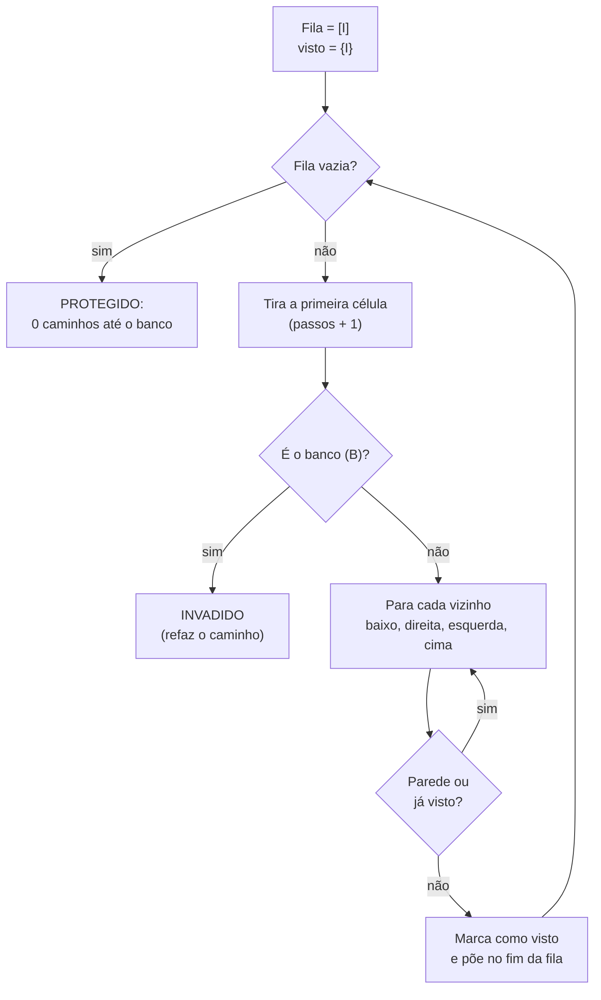

# Caminho do invasor (busca em largura e defesa em camadas)

> Reel: (link em breve)

Um "invasor" sai da **Internet** e procura **qualquer caminho** até o **banco de dados** num mapa de rede,
usando **busca em largura (BFS)**. Na primeira rodada a rede não tem defesas. Na segunda entram quatro camadas,
cada uma **com furos**, e mesmo assim o banco fica protegido. É a ideia de **defesa em camadas**.

> Demo educativa: o "invasor" é só uma busca num mapa abstrato (uma lista de textos). Nada de rede, IPs,
> ferramentas ou alvos reais. Veja [seguranca-didatica.md](../seguranca-didatica.md).

| | |
|---|---|
| Biblioteca | [`src/Enneal.Algoritmos.CaminhoInvasor`](../../src/Enneal.Algoritmos.CaminhoInvasor) |
| Exemplo | [`samples/caminho-do-invasor`](../../samples/caminho-do-invasor) |
| Testes | [`CaminhoInvasorTests.cs`](../../tests/Enneal.Algoritmos.Tests/Algoritmos/CaminhoInvasorTests.cs) |

---

## O mapa

```
I = Internet (início)   B = banco de dados   # = parede   . = livre

 sem defesas          em camadas
 ......I......        ......I......
 .............        .............
 .##..###..##.        .##..###..##.
 .............        .............
 ...#.....#...        ##.######.###   camada 1: WAF
 .#....#....#.        ####.####.###   camada 2: MFA no login
 ....#...#....        #.#########.#   camada 3: menor privilégio
 .............        #######.#####   camada 4: criptografia + segmentação
 ......B......        ......B......
```

Na segunda rodada o invasor ainda passa por furos do WAF e do MFA, e isso é de propósito: **nenhuma camada
sozinha é perfeita**. O que barra o ataque é que os furos de uma camada não se alinham com os da seguinte.

## Como funciona a BFS



Como explora em "ondas" (tudo a 1 passo, depois tudo a 2 passos...), a BFS sempre encontra o caminho **mais
curto**. O exemplo refaz esse caminho e desenha no mapa com `*`.

## O código do Reel

```csharp
bool Invadir(int r0, int c0) {
  Queue<(int, int)> fila = new([(r0, c0)]);
  HashSet<(int, int)> visto = [(r0, c0)];
  while (fila.Count > 0) {
    var (r, c) = fila.Dequeue(); passos++;
    if (mapa[r][c] == 'B') return true;
    foreach (var (nr, nc) in Vizinhos(r, c)) {
      if (mapa[nr][nc] == '#') continue;
      if (!visto.Add((nr, nc))) continue;
      fila.Enqueue((nr, nc));
    } }
  return false; // 0 caminhos até o banco
}
```

## Complexidade

| Medida | Valor | Observação |
|--------|-------|------------|
| Tempo | O(V + E) | cada célula entra na fila no máximo uma vez; neste mapa 9 x 13, no máximo 117 células |
| Memória | O(V) | a fila, o conjunto de vistos e o mapa de "de onde veio" |
| Caminho | o mais curto | garantido pela exploração em ondas |

## Números do Reel

| Rodada | Resultado | Passos |
|--------|-----------|-------:|
| Sem defesas | INVADIDO (caminho mais curto: 12 movimentos) | 93 |
| Em camadas | PROTEGIDO, 0 caminhos até o banco | 48 células exploradas |

## Usando a biblioteca

```csharp
using Enneal.Algoritmos.CaminhoInvasor;

var r = BuscaInvasor.Invadir(MapasDoReel.EmCamadas);
Console.WriteLine($"{r.Invadido} em {r.Passos} passos"); // False em 48 passos
```

## Como se defender

- **Defesa em camadas:** não aposte numa barreira só. Combine firewall de aplicação (WAF), autenticação forte,
  permissões mínimas e segmentação de rede, para que a falha de uma camada não exponha tudo.
- **MFA** em todos os acessos administrativos e remotos.
- **Menor privilégio:** cada usuário, serviço e aplicação acessa só o que precisa. A aplicação não deve conectar
  no banco com uma conta de administrador.
- **Segmentação:** o banco de dados não deve ser alcançável direto da Internet, só pelas máquinas que realmente
  precisam dele.
- **Criptografia** em trânsito (TLS) e em repouso, para dados roubados não serem legíveis.
- **Monitoramento:** registre e revise acessos para perceber movimentação estranha entre as camadas.
- **Teste os seus furos:** revisões de configuração e testes de intrusão **autorizados** mostram onde as camadas se
  alinham antes que alguém descubra.
