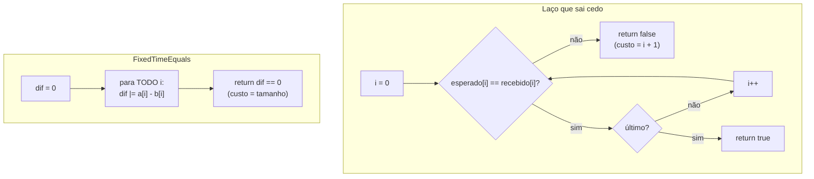

# Comparação em tempo constante

> Reel: (link em breve)

`if (token == recebido)` parece inofensivo, mas o `==` (e qualquer laço que **sai no primeiro caractere
diferente**) trabalha mais quando mais letras do começo estão certas. Esse "quanto trabalhou" vaza, aos poucos, o
prefixo certo de um segredo. O conserto é uma linha do .NET: `CryptographicOperations.FixedTimeEquals`, que percorre
todos os bytes e custa sempre o mesmo.

> **Modelo didático e determinístico.** O "custo" aqui é o número de comparações de caractere de cada versão. Não é
> medição de tempo e não tem alvo nenhum: o token (`7F3A9C`) e os 6 candidatos são de brinquedo. Veja
> [seguranca-didatica.md](../seguranca-didatica.md).

| | |
|---|---|
| Biblioteca | [`src/Enneal.Algoritmos.ComparacaoSegura`](../../src/Enneal.Algoritmos.ComparacaoSegura) |
| Exemplo | [`samples/comparacao-tempo-constante`](../../samples/comparacao-tempo-constante) |
| Testes | [`ComparacaoSeguraTests.cs`](../../tests/Enneal.Algoritmos.Tests/Algoritmos/ComparacaoSeguraTests.cs) |

---

## O modelo de custo

| Versão | Custo (comparações de caractere) |
|--------|----------------------------------|
| Laço que sai cedo | `prefixo igual + 1` (ou o tamanho, se todas baterem) |
| `FixedTimeEquals` | sempre o tamanho (6) |

Na prática a diferença por caractere é pequena e cheia de ruído, mas existe e pode ser medida com muitas
repetições. Por isso a recomendação para segredos é sempre comparar em tempo constante. O modelo deixa a diferença
visível e igual em qualquer computador.

## Como funciona



## O código do Reel

```csharp
// ERRADO pra segredo: o custo depende do prefixo
static bool IgualInseguro(string esperado, string recebido)
{
    if (esperado.Length != recebido.Length) return false;
    for (int i = 0; i < esperado.Length; i++)
        if (esperado[i] != recebido[i])
            return false;           // sai no 1º diferente
    return true;
}

// CERTO: compara os bytes em tempo constante
static bool IgualSeguro(string esperado, string recebido) =>
    CryptographicOperations.FixedTimeEquals(
        Encoding.UTF8.GetBytes(esperado), Encoding.UTF8.GetBytes(recebido));

// o que o FixedTimeEquals faz por dentro (modelo)
int dif = 0;
for (int i = 0; i < a.Length; i++)
    dif |= a[i] - b[i];   // sem if, sem saída cedo
return dif == 0;
```

O exemplo confere, para cada candidato, que o modelo dá exatamente a mesma resposta do `FixedTimeEquals` real.

## Complexidade

| Medida | Laço que sai cedo | `FixedTimeEquals` |
|--------|-------------------|-------------------|
| Pior caso | O(n) | O(n) |
| Custo depende do conteúdo? | **sim** (do prefixo certo) | não |

O tempo constante não é mais lento no pior caso; ele só não "termina cedo" quando erra.

## Números do Reel

| Candidato | Prefixo igual | Sai cedo: custo | `FixedTimeEquals`: custo | Resposta |
|-----------|--------------:|----------------:|-------------------------:|----------|
| 1 `B04E21` | 0 | 1 | 6 | false |
| 2 `7F3D58` | 3 | 4 | 6 | false |
| 3 `7A0B6E` | 1 | 2 | 6 | false |
| 4 `7F3A92` | 5 | 6 | 6 | false |
| 5 `7F1C07` | 2 | 3 | 6 | false |
| 6 `7F3A9C` | 6 | 6 | 6 | **true** |

Barra mais alta = mais letras certas no começo. Em tempo constante, todas param em 6: "o tempo não conta nada". As
respostas são as mesmas nas duas versões (6/6).

## Usando a biblioteca

```csharp
using Enneal.Algoritmos.ComparacaoSegura;

bool ok = ComparacaoDeSegredos.IgualSeguro(tokenEsperado, tokenRecebido);

var r = DemoDoReel.Rodar();
Console.WriteLine(string.Join(", ", r.Select(x => x.CustoSaiCedo)));        // 1, 4, 2, 6, 3, 6
Console.WriteLine(string.Join(", ", r.Select(x => x.CustoTempoConstante))); // 6, 6, 6, 6, 6, 6
```

## Como se defender

- **Compare segredos com `CryptographicOperations.FixedTimeEquals`:** token de API e de sessão, assinatura HMAC de
  webhook, código de reset de senha e de 2FA, chaves de idempotência privadas.
- **Senha não se compara:** guarde o hash (`PasswordHasher<T>` do ASP.NET Core Identity, PBKDF2, Argon2) e use a
  verificação da biblioteca, que já confere em tempo constante. Veja
  [força bruta x login protegido](forca-bruta-senha.md).
- **O tamanho não é segredo** para o `FixedTimeEquals` (tamanhos diferentes devolvem `false` na hora). Se o tamanho
  importar, compare um HMAC ou hash de tamanho fixo dos dois lados.
- **Para HMAC**, prefira as APIs que já verificam (`HMACSHA256.HashData` + `FixedTimeEquals`), nunca
  `Convert.ToHexString(a) == recebido`.
- **Limite tentativas** (rate limit e bloqueio): mesmo com tempo constante, ninguém deveria poder testar milhares de
  tokens. Veja [rate limit x DDoS](rate-limit-token-bucket.md).

## Exercícios

1. Troque o token por um de 32 caracteres e confira que o custo em tempo constante vira sempre 32.
2. Escreva um teste que procura, num projeto seu, comparações de segredo com `==` (por exemplo `token ==`).
3. Faça o `IgualSeguro` comparar o SHA-256 dos dois textos, para que o tamanho também não importe.
