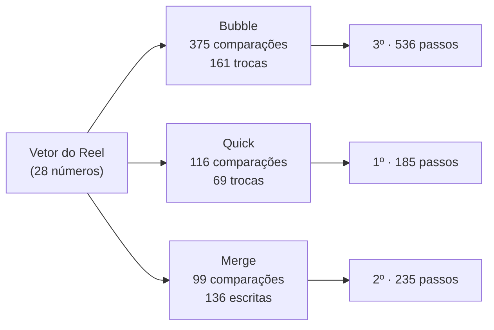

# Corrida de ordenações: Bubble x Quick x Merge

> Reel: (link em breve)

Três algoritmos de ordenação clássicos apostam corrida no **mesmo vetor** de 28 números embaralhados.
Quem precisar de **menos passos** para deixar tudo em ordem vence.

| | |
|---|---|
| Biblioteca | [`src/Enneal.Algoritmos.Ordenacoes`](../../src/Enneal.Algoritmos.Ordenacoes) |
| Exemplo | [`samples/corrida-de-ordenacoes`](../../samples/corrida-de-ordenacoes) |
| Testes | [`OrdenacoesTests.cs`](../../tests/Enneal.Algoritmos.Tests/Algoritmos/OrdenacoesTests.cs) |

---

## A regra da corrida

**1 passo = 1 comparação, 1 troca ou 1 escrita no vetor.** Os três algoritmos mexem no vetor só pelos métodos
`Menor`, `Troca` e `Escreve` do `ContadorDePassos`, então a disputa é justa.

O vetor é `1..28` embaralhado uma vez com semente fixa (2026) e escrito no código, para todo mundo rodar com o
mesmo vetor do vídeo.

## Os competidores

| Algoritmo | Ideia | Melhor | Médio | Pior | Memória extra | Estável |
|-----------|-------|--------|-------|------|---------------|---------|
| **Bubble Sort** | compara vizinhos e troca os fora de ordem; o maior "borbulha" para o fim a cada volta | O(n) | O(n²) | O(n²) | O(1) | sim |
| **Quick Sort** | pivô = último do trecho (Lomuto); menores à esquerda, maiores à direita; repete em cada lado | O(n log n) | O(n log n) | O(n²) | O(log n) | não |
| **Merge Sort** | divide ao meio, ordena cada metade e intercala as duas | O(n log n) | O(n log n) | O(n log n) | O(n) | sim |



## O código do Reel (Quick Sort)

```csharp
void Quick(int[] v, int ini, int fim) {
    if (ini >= fim) return;
    int pivo = v[fim], i = ini;
    for (int j = ini; j < fim; j++)
        if (Menor(v[j], pivo))
            Troca(v, i++, j);
    Troca(v, i, fim);
    Quick(v, ini, i - 1);
    Quick(v, i + 1, fim);
}
```

## Números do Reel

| Algoritmo | Comparações | Trocas | Escritas | Passos | Chegada |
|-----------|------------:|-------:|---------:|-------:|---------|
| Quick | 116 | 69 | 0 | **185** | 1º |
| Merge | 99 | 0 | 136 | **235** | 2º |
| Bubble | 375 | 161 | 0 | **536** | 3º |

O Merge faz menos comparações (99) que o Quick (116), mas gasta mais escritas copiando de volta do vetor
auxiliar. As 161 trocas do Bubble são exatamente as 161 **inversões** do vetor (pares fora de ordem): cada troca de
vizinhos desfaz uma. Os testes conferem essa propriedade em vetores aleatórios.

## Usando a biblioteca

```csharp
using Enneal.Algoritmos.Ordenacoes;

int[] v = [5, 2, 9, 1];
var passos = Ordenacao.QuickSort(v);       // v agora é [1, 2, 5, 9]
Console.WriteLine(passos.Passos);

foreach (var r in CorridaDeOrdenacoes.Correr(CorridaDeOrdenacoes.VetorDoReel))
    Console.WriteLine($"{r.Nome}: {r.Passos}"); // Bubble 536, Quick 185, Merge 235
```

## Para praticar

- Rode a corrida com o vetor **já ordenado** e com o vetor **ao contrário**: o Bubble melhora muito, e o Quick com
  pivô no fim piora (vira O(n²)).
- Troque o pivô do Quick pelo elemento do meio e compare os passos.
- Adicione um quarto competidor (Insertion Sort, por exemplo) usando o mesmo `ContadorDePassos`.
