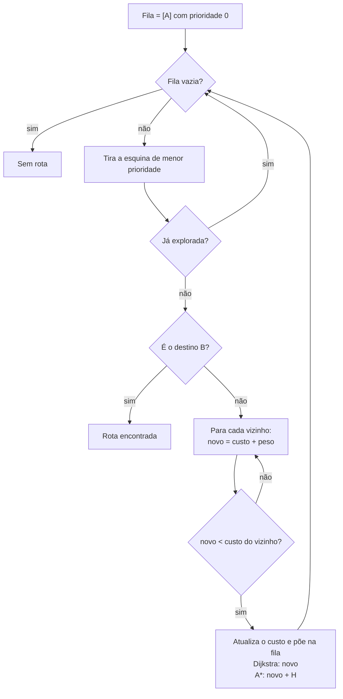

# Como o GPS acha a rota: Dijkstra x A* (A-estrela)

> Reel: (link em breve)

O mesmo mapa de cidade é resolvido duas vezes: primeiro com **Dijkstra**, depois com **A\***. As duas buscas acham
a **mesma rota mais barata**, mas o A\* explora **70% menos** esquinas, porque sabe para que lado fica o destino.

| | |
|---|---|
| Biblioteca | [`src/Enneal.Algoritmos.MenorCaminho`](../../src/Enneal.Algoritmos.MenorCaminho) |
| Exemplo | [`samples/dijkstra-a-estrela`](../../samples/dijkstra-a-estrela) |
| Testes | [`MenorCaminhoTests.cs`](../../tests/Enneal.Algoritmos.Tests/Algoritmos/MenorCaminhoTests.cs) |

---

## O mapa

```
A = partida   B = destino   . = rua (1)   m = trânsito (3)   T = engarrafado (6)   # = prédio   P = praça

........m........
.##.###.#.###.##.
.##.###...###.##.
.##...........##.
A.....TTTT......B
.##.mmmmmm....##.
.##.PPP...###.##.
.##.PPP.#.###.##.
........m........
```

O custo é o de **entrar** na esquina: rua 1, trânsito 3, engarrafamento 6. Prédios e a praça bloqueiam.

## Como funciona

As duas buscas usam uma **fila de prioridade** e sempre exploram primeiro a esquina mais promissora. A ÚNICA
diferença é a prioridade:

| Algoritmo | Prioridade na fila | Comportamento |
|-----------|-------------------|---------------|
| **Dijkstra** | `custo` até a esquina | espalha-se em anel para todos os lados |
| **A\*** | `custo + H(esquina)` | vai direto para o destino |

`H` é a **distância Manhattan** até o destino (quantas quadras, ignorando prédios e trânsito). Como `H` nunca passa
do custo real (heurística **admissível**), a rota do A\* continua a mais barata.



## O código do Reel (A\*)

```csharp
int AEstrela() {
  var fila = new PriorityQueue<(int, int), int>();
  fila.Enqueue(A, 0); custo[A] = 0;
  while (fila.TryDequeue(out var u, out _)) {
    if (!feito.Add(u)) continue;  // já explorado
    if (u == B) return custo[B];
    foreach (var v in Vizinhos(u)) {
      int novo = custo[u] + Peso(v);
      if (novo >= custo[v]) continue;
      custo[v] = novo;
      fila.Enqueue(v, novo + H(v));   // no Dijkstra: fila.Enqueue(v, novo)
  } }
  return -1; }
```

## Complexidade

| Medida | Dijkstra | A\* |
|--------|----------|-----|
| Tempo (pior caso) | O((V + E) log V) | O((V + E) log V) |
| Na prática | explora tudo que é mais barato que o destino | explora só o que parece levar ao destino |
| Memória | O(V) | O(V) |
| Rota ótima? | sim (pesos não negativos) | sim, com heurística admissível |

## Números do Reel

| Algoritmo | Custo da rota | Nós explorados |
|-----------|--------------:|---------------:|
| Dijkstra | 18 | 89 |
| A\* | 18 | 27 |
| | | **A\* explorou 70% menos** |

A rota (as duas são iguais) desvia do engarrafamento: `4,0 4,1 4,2 4,3 4,4 4,5 3,5 3,6 ... 3,10 4,10 ... 4,16`.

## Usando a biblioteca

```csharp
using Enneal.Algoritmos.MenorCaminho;

var dijkstra = BuscaDeRota.Dijkstra(MapaDaCidade.DoReel);
var aEstrela = BuscaDeRota.AEstrela(MapaDaCidade.DoReel);
Console.WriteLine($"{dijkstra.Custo} / {dijkstra.NosExplorados}");  // 18 / 89
Console.WriteLine($"{aEstrela.Custo} / {aEstrela.NosExplorados}");  // 18 / 27
```

## Para praticar

- Troque a heurística por `0`: o A\* vira o Dijkstra (mesmos 89 nós).
- Multiplique a heurística por 3 (heurística **não** admissível): ele explora ainda menos, mas a rota pode deixar de
  ser a mais barata. Compare os custos e veja por que a admissibilidade importa.
- Desenhe seu próprio bairro como mapa e compare os dois.
