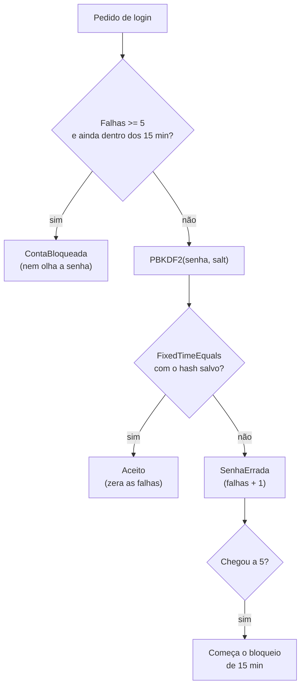

# Força bruta x login protegido (simulação didática)

> Reel: (link em breve)

**Força bruta** é testar todas as senhas possíveis até acertar. Contra um PIN de 4 dígitos sem proteção isso é
trivial. Este exemplo mostra o ataque e, principalmente, **como um login bem feito o torna inviável**.

> **Simulação de brinquedo, para ensinar defesa.** O "alvo" é um PIN que está na memória do próprio programa.
> Não há rede, arquivos, sistemas de terceiros nem senhas reais. A biblioteca só aceita PINs de 4 dígitos e só
> "ataca" um `LoginProtegido` criado no mesmo processo. Veja [seguranca-didatica.md](../seguranca-didatica.md).

| | |
|---|---|
| Biblioteca | [`src/Enneal.Algoritmos.ForcaBruta`](../../src/Enneal.Algoritmos.ForcaBruta) |
| Exemplo | [`samples/forca-bruta-senha`](../../samples/forca-bruta-senha) |
| Testes | [`ForcaBrutaTests.cs`](../../tests/Enneal.Algoritmos.Tests/Algoritmos/ForcaBrutaTests.cs) |

---

## Os dois rounds

- **Round 1, sem proteção:** um laço testa `0000`, `0001`, `0002`... e abre o PIN `7391` em **7.392 tentativas**.
  São só 10.000 combinações, então um computador faz isso num piscar de olhos.
- **Round 2, login protegido:** o **mesmo laço** contra o `LoginProtegido`, que:
  - guarda só o **hash** da senha, com **salt** aleatório e um algoritmo **lento** de propósito (PBKDF2-SHA256,
    600.000 iterações, que já vem no .NET);
  - compara os hashes em **tempo constante** (`CryptographicOperations.FixedTimeEquals`);
  - conta as falhas e **bloqueia a conta por 15 minutos depois de 5 erros** (o bloqueio vence sozinho).

  Resultado: **bloqueado após 5 tentativas**. Para chegar no mesmo PIN do Round 1 seriam **1.478 bloqueios**, ou
  **15,4 dias** de espera, e isso para um PIN de só 4 dígitos.



## O código do Reel (Round 1)

```csharp
string pin = "7391";       // na memória
int tentativas = 0;
for (int n = 0; n <= 9999; n++) {
    tentativas++;
    string palpite = n.ToString("D4");
    if (palpite == pin) {
        Console.WriteLine("ABERTO!");
        break;
    }
}
Console.WriteLine(tentativas); // 7392
```

## Complexidade

| Cenário | Custo para o atacante |
|---------|-----------------------|
| PIN de 4 dígitos, sem proteção | até 10⁴ = 10.000 comparações (instantâneo) |
| Senha de 12 caracteres (~95 símbolos) | até 95¹² ≈ 5,4 x 10²³ tentativas |
| Hash lento (PBKDF2 600k) | cada tentativa custa centenas de milissegundos de CPU |
| Bloqueio 5 erros / 15 min | o tempo passa a depender do relógio: a cada 5 erros, 15 min parado |

Força bruta é **O(Kᴸ)** no pior caso (K = tamanho do alfabeto, L = tamanho da senha). As defesas não mudam essa
conta: mudam **quanto custa cada tentativa** e **quantas dá para fazer**.

## Números do Reel

| Medida | Valor |
|--------|------:|
| Tentativas sem proteção (PIN 7391) | 7.392 |
| Falhas até o bloqueio | 5 |
| Pedido que encontra a conta bloqueada | 6º |
| Bloqueios para chegar no mesmo PIN | 1.478 |
| Espera total | 15,4 dias |

## Usando a biblioteca

```csharp
using Enneal.Algoritmos.ForcaBruta;

var login = new LoginProtegido("7391");          // guarda só salt + hash
Console.WriteLine(login.Tentar("0000"));          // SenhaErrada
Console.WriteLine(login.Tentar("7391"));          // Aceito

var round2 = SimulacaoForcaBruta.TentarContraLogin(new LoginProtegido("7391"));
Console.WriteLine($"{round2.Falhas} falhas, bloqueado: {round2.Bloqueado}"); // 5 falhas, bloqueado: True
```

## Como se defender

- **Limite de tentativas** no servidor: bloqueio temporário ou espera crescente (1 s, 2 s, 4 s...) depois de
  algumas falhas, por conta **e** por origem. Prefira bloqueio temporário a permanente, para ninguém conseguir
  trancar a conta dos seus usuários de propósito.
- **Nunca guarde senha em texto.** Guarde só o hash, com salt único por usuário e um algoritmo lento feito para
  senhas: **Argon2id**, **bcrypt** ou **PBKDF2** com muitas iterações. Hash rápido (MD5, SHA-1, SHA-256 puro) não
  serve para senha.
- **Compare em tempo constante** (`CryptographicOperations.FixedTimeEquals`).
- **Senhas longas** (frases-senha) valem mais que senhas "complicadas" e curtas.
- **Autenticação em dois fatores (MFA):** mesmo que a senha vaze, só ela não basta.
- **Monitore e alerte:** muitas falhas seguidas, vindas de vários lugares, é sinal de ataque.
- **Não reaproveite senhas** entre sites: um vazamento em um lugar vira acesso em outro.
- Em produção, use a solução de identidade da sua plataforma (por exemplo **ASP.NET Core Identity**, que já tem
  hash de senha e lockout prontos) em vez de escrever a sua.
