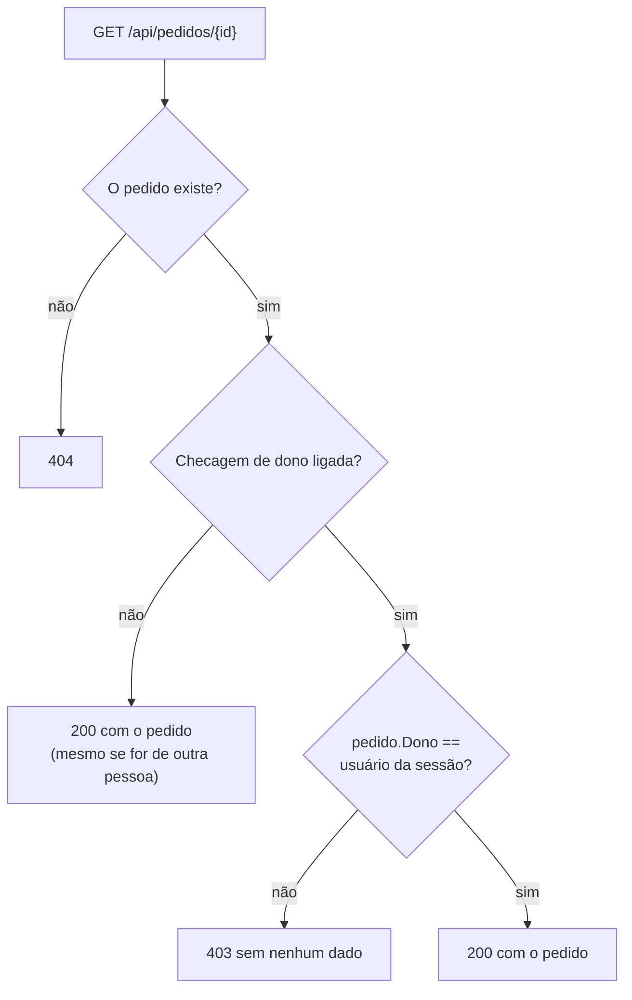

# Controle de acesso quebrado (IDOR): a checagem de dono

> Reel: (link em breve)

Logada como a cliente **#41**, a Ana abre `/api/pedidos/41` e vê o próprio pedido. Se trocar o número da URL para
42, 43, 44 ou 45 e a API devolver o pedido de outra pessoa, a API tem **controle de acesso quebrado** (IDOR,
*Insecure Direct Object Reference*), o primeiro item do OWASP Top 10 (A01). A correção é uma linha: conferir o
**dono** do pedido antes de responder.

> **Teste local e defensivo.** A "API" é uma função C# e os pedidos estão em memória, com nomes e documentos
> fictícios (já mascarados). Nada aqui gera tráfego de rede. Rode um teste assim na **sua** API, em ambiente de
> teste. Veja [seguranca-didatica.md](../seguranca-didatica.md).

| | |
|---|---|
| Biblioteca | [`src/Enneal.Algoritmos.ControleDeAcesso`](../../src/Enneal.Algoritmos.ControleDeAcesso) |
| Exemplo | [`samples/idor-checagem-de-dono`](../../samples/idor-checagem-de-dono) |
| Testes | [`ControleDeAcessoTests.cs`](../../tests/Enneal.Algoritmos.Tests/Algoritmos/ControleDeAcessoTests.cs) |

---

## O cenário

| Parâmetro | Valor |
|-----------|-------|
| Pedidos | 5 (ids 41 a 45), cada um de um cliente diferente |
| Quem está logada | a Ana, cliente #41 (o id vem da **sessão**, nunca da URL) |
| Teste | pedir `/api/pedidos/41` a `45` e contar quantos pedidos de outras pessoas voltam |

Respostas possíveis: **200** (pedido entregue), **403** (é de outra pessoa: negado, sem dados) e **404** (não existe).

## Como funciona



O erro não é "esconder mal" o id. Ids sequenciais ajudam a achar o problema, mas a falha é a API **confiar no id da
URL** e não perguntar "esse pedido é de quem está logado?".

## O código da checagem

```csharp
public RespostaApi Buscar(int id, int usuarioDaSessao, bool checarDono)
{
    if (!_pedidos.TryGetValue(id, out var p))
        return new RespostaApi(404, null);   // não existe
    if (checarDono && p.Dono != usuarioDaSessao)
        return new RespostaApi(403, null);   // é de outra pessoa: nega e não mostra nada
    return new RespostaApi(200, p);          // sem a checagem, entrega o que achou
}
```

## Complexidade

| Medida | Valor |
|--------|-------|
| Tempo por requisição | O(1) (busca no dicionário + 1 comparação) |
| Teste de acesso | O(número de ids testados) |

## Números do Reel

| Rodada | Requisições | 200 | 403 | Pedidos de outras pessoas vazados |
|--------|------------:|----:|----:|----------------------------------:|
| Sem checagem de dono | 5 | 5 | 0 | **4** |
| Com checagem de dono | 5 | 1 | **4** | **0** |

## Usando a biblioteca

```csharp
using Enneal.Algoritmos.ControleDeAcesso;

var api = ApiDePedidos.DoReel();
var r = TesteDeAcesso.Rodar(api, ids: [41, 42, 43, 44, 45], usuarioDaSessao: 41, checarDono: true);
Console.WriteLine($"{r.Ok} ok, {r.Negadas} negadas, {r.Vazadas} vazadas"); // 1 ok, 4 negadas, 0 vazadas
```

## Como se defender

- **Toda rota que recebe um id confere o dono** (ou a permissão) no servidor, a cada requisição. No ASP.NET Core,
  use *resource-based authorization*: `IAuthorizationService.AuthorizeAsync(User, pedido, "DonoDoPedido")`.
- **O usuário vem da sessão ou do token**, nunca de um parâmetro que o cliente controla (`?usuario=41`).
- **Filtre na consulta:** `WHERE id = @id AND dono = @usuario` evita até carregar o dado de outra pessoa.
- **Responda 403 ou 404 sem dados.** Muitas APIs preferem 404 para não confirmar que o id existe.
- **Ids difíceis de adivinhar (GUID) ajudam, mas não substituem a checagem.**
- **Teste automatizado no CI:** logado como um usuário de teste, peça recursos de outro usuário de teste e falhe o
  build se algum voltar 200. É exatamente o `TesteDeAcesso` deste exemplo.
- **Registre e alerte** sequências de 403 do mesmo usuário: podem indicar alguém testando ids.

## Exercícios

1. Adicione um papel "atendente" que pode ver qualquer pedido, mas só com o documento mascarado.
2. Troque o 403 por 404 e ajuste o `TesteDeAcesso` para continuar contando vazamentos corretamente.
3. Escreva um teste que falha se qualquer id de 1 a 1000 voltar 200 para um usuário que não é o dono.
