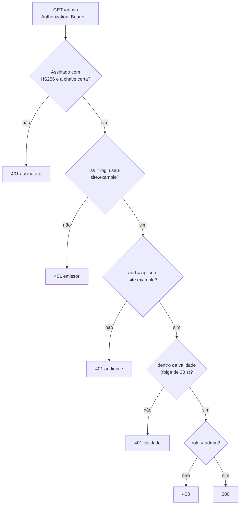

# Validando JWT do jeito certo

> Reel: (link em breve)

Um JWT é `header.payload.assinatura`, e **header e payload são só base64url**: qualquer um lê e qualquer um edita. Quem
garante que ninguém mexeu é a **assinatura**, e quem garante que a assinatura é conferida é a **configuração da sua
API**. Com a validação frouxa, um token com o `role` trocado para `admin` e sem assinatura recebe **200 OK**. Com a
configuração certa do JwtBearer no ASP.NET Core 8, os 4 tokens ruins recebem 401.

> **Só localhost, valores de brinquedo.** As duas APIs sobem em `127.0.0.1` numa porta livre. Hosts fictícios
> (`seu-site.example`), chave de demonstração (o SHA-256 de uma frase fixa, pública de propósito) e tokens de
> brinquedo. Os tokens "ruins" são os **testes negativos** que a sua API precisa recusar. Veja
> [seguranca-didatica.md](../seguranca-didatica.md).

| | |
|---|---|
| Biblioteca | [`src/Enneal.Algoritmos.ValidacaoJwt`](../../src/Enneal.Algoritmos.ValidacaoJwt) |
| Exemplo | [`samples/jwt-validacao`](../../samples/jwt-validacao) |
| Testes | [`ValidacaoJwtTests.cs`](../../tests/Enneal.Algoritmos.Tests/Algoritmos/ValidacaoJwtTests.cs) |
| Pacote | `Microsoft.AspNetCore.Authentication.JwtBearer` 8.0.11 (oficial da Microsoft; o único pacote das bibliotecas) |

---

## Anatomia do token

```
header    {"alg":"HS256","typ":"JWT"}
payload   {"sub":"ana","role":"cliente","aud":"api.seu-site.example","iss":"https://login.seu-site.example",
           "exp":1791461400,"iat":1791460500,"nbf":1791460500}
assinatura HMAC-SHA256(header.payload, chave)
```

O `exp` vale 15 minutos depois do `iat`. Nada no payload é secreto.

## Os 6 tokens

| # | Token | Frouxa | Certa | Por que a certa decide assim (`WWW-Authenticate` do JwtBearer) |
|---|-------|-------:|------:|-----------------------------------------------------------------|
| 0 | original, `role: cliente` | 403 | 403 | autenticado, mas `RequireRole("admin")` nega |
| 1 | `role` editado + `alg: none`, sem assinatura | **200** | 401 | `The signature is invalid` (`RequireSignedTokens = true`) |
| 2 | `role` editado, assinatura antiga | 401 | 401 | `The signature key was not found` (o HMAC não confere) |
| 3 | admin emitido para outra API (`aud: relatorios.seu-site.example`) | **200** | 401 | `The audience '...' is invalid` |
| 4 | admin vencido (`exp` há 1 h 45) | **200** | 401 | `The token lifetime is invalid` |
| 5 | admin de verdade | 200 | 200 | válido |

Os tokens 3, 4 e 5 são assinados com a chave certa (tokens "de verdade" que vazaram de outro sistema ou ficaram
velhos); o 1 e o 2 são o original com o payload editado, como qualquer cliente consegue fazer com o próprio token.

## Como funciona



## O código do Reel

```csharp
// ERRADO: aceita token sem assinatura e não confere nada
static TokenValidationParameters Frouxa(byte[] k) => new()
{
    RequireSignedTokens = false,       // aceita alg "none"
    ValidateIssuer = false,
    ValidateAudience = false,
    ValidateLifetime = false,
    IssuerSigningKey = new SymmetricSecurityKey(k),
};

// CERTO: alg fixo, chave forte, emissor, audience, validade
static TokenValidationParameters Certa(byte[] k) => new()
{
    ValidAlgorithms = [SecurityAlgorithms.HmacSha256],
    RequireSignedTokens = true,
    IssuerSigningKey = new SymmetricSecurityKey(k), // 256 bits
    ValidateIssuerSigningKey = true,
    ValidIssuer = "https://login.seu-site.example",
    ValidAudience = "api.seu-site.example",
    ValidateLifetime = true,
    RequireExpirationTime = true,
    ClockSkew = TimeSpan.FromSeconds(30),
};

builder.Services.AddAuthentication(JwtBearerDefaults.AuthenticationScheme)
    .AddJwtBearer(o => o.TokenValidationParameters = Certa(chave));
app.MapGet("/admin", () => "painel admin").RequireAuthorization(p => p.RequireRole("admin"));
```

## Detalhes honestos

- **Relógio da demo (só no teste).** Os tokens usam um instante fixo (08/10/2026 12:00 UTC) para saírem byte a byte
  iguais em qualquer dia. Por isso, só no teste, a API certa recebe um `LifetimeValidator` com a mesma regra do
  `ValidateLifetime` (`nbf <= agora + folga`, `exp >= agora - folga`) aplicada a esse relógio
  (`ValidacaoDeTokens.CertaNoRelogio`). **Em produção não se mexe nisso:** `ValidacaoDeTokens.Certa` não tem
  `LifetimeValidator` e usa o relógio do servidor. É também por isso que a mensagem do token vencido é
  `The token lifetime is invalid` (com o relógio do sistema seria `The token expired at ...`).
- **Chave fraca.** O `JsonWebTokenHandler` recusa assinar com `"segredo123"` (80 bits): `IDX10653`, mínimo 128.
  Nesta versão (Microsoft.IdentityModel 7.1.2), o HS256 recusa até chaves de 128 a 255 bits (`IDX10720`, mínimo
  256). Mesmo assim, o que importa é a origem: 32 bytes **aleatórios** (`RandomNumberGenerator.GetBytes(32)`) num
  cofre de segredos, nunca uma frase.
- **alg none.** O JwtBearer do .NET 8 já exige assinatura por padrão. O erro mostrado (`RequireSignedTokens = false`)
  é o tipo de "conserto" que aparece quando alguém tenta fazer um token passar sem entender o erro.

## Complexidade

| Medida | Valor |
|--------|-------|
| Validação de um token | O(tamanho do token): 1 HMAC-SHA256 e algumas comparações |
| Estado no servidor | nenhum (o token carrega tudo); por isso a validade curta importa |

## Números do Reel

| | API frouxa | API certa |
|---|-----------:|----------:|
| Tokens ruins aceitos (200) | **3 de 4** | **0 de 4** |
| Admin de verdade | 200 | 200 |
| Cliente no `/admin` | 403 | 403 |

E `"segredo123"` (80 bits) é recusada pelo .NET: `IDX10653`, mínimo 128.

## Usando a biblioteca

```csharp
using Enneal.Algoritmos.ValidacaoJwt;

byte[] chave = EmissorDeTokens.ChaveDeDemo();     // só demo! em produção: cofre de segredos
await using var api = await ApiDeTeste.SubirAsync(ValidacaoDeTokens.Certa(chave)); // 127.0.0.1

string token = EmissorDeTokens.Emitir(chave, "bia", "admin", EmissorDeTokens.Publico, DateTime.UtcNow);
var r = await api.PedirAsync(token);
Console.WriteLine(r.Status);                                                       // 200

var editado = TokensDeTesteNegativo.SemAssinatura(TokensDeTesteNegativo.TrocarPapel(token, "admin"));
Console.WriteLine((await api.PedirAsync(editado)).Status);                         // 401
```

## Como se defender

- **Fixe o algoritmo** (`ValidAlgorithms`) e **exija assinatura** (`RequireSignedTokens = true`, o padrão).
- **Confira emissor e audience** (`ValidIssuer`, `ValidAudience`): um token de outra API do mesmo emissor não pode
  valer na sua.
- **Validade curta** (minutos) com `ValidateLifetime` e `ClockSkew` pequeno; para sessões longas, use refresh token
  com rotação.
- **Chave forte e fora do código:** 32 bytes aleatórios num cofre de segredos, com rotação; ou chave assimétrica
  (RS256/ES256) com o emissor publicando as chaves públicas (OpenID Connect + `Authority`).
- **Não coloque segredo no payload:** qualquer um decodifica.
- **Autorização além da autenticação:** token válido não é permissão; use papéis/políticas (`RequireRole`,
  `RequireClaim`) e checagem de dono nos recursos (veja [IDOR](idor-checagem-de-dono.md)).
- **Testes negativos no CI:** os tokens 1 a 4 deste exemplo são exatamente os casos que a sua API precisa recusar.

## Exercícios

1. Troque o HS256 por ES256 (`ECDsa.Create`) e ajuste `ValidAlgorithms` e a chave de validação.
2. Diminua o `ClockSkew` para zero e veja em que minuto o token 5 deixa de valer no relógio da demo.
3. Adicione um token com `iss` de outro emissor e confira a mensagem do 401.
