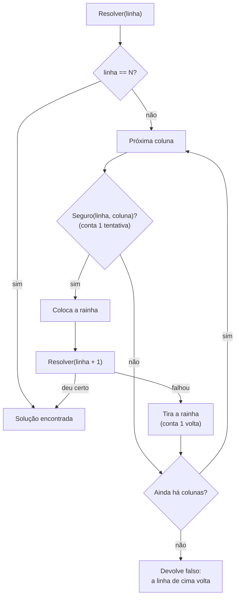

# N-Rainhas (backtracking)

> Reel: (link em breve)

Como colocar **N rainhas** num tabuleiro **N x N** sem que nenhuma ataque outra (mesma linha, coluna ou
diagonal)? O programa testa casa por casa e, quando chega num beco sem saída, **volta** e tenta outra opção.
Essa técnica se chama **backtracking** ("tentar e voltar").

| | |
|---|---|
| Biblioteca | [`src/Enneal.Algoritmos.NRainhas`](../../src/Enneal.Algoritmos.NRainhas) |
| Exemplos | [`samples/n-rainhas-8x8`](../../samples/n-rainhas-8x8) e [`samples/n-rainhas-4x4-ate-8x8`](../../samples/n-rainhas-4x4-ate-8x8) |
| Testes | [`NRainhasTests.cs`](../../tests/Enneal.Algoritmos.Tests/Algoritmos/NRainhasTests.cs) |

---

## Como funciona

1. Coloca **uma rainha por linha**, de cima para baixo (assim nunca há duas na mesma linha).
2. Em cada linha, testa as colunas da esquerda para a direita com `Seguro(linha, coluna)`.
3. A casa é segura se nenhuma rainha de cima está na **mesma coluna** (`q == c`) nem na **mesma diagonal**
   (`Abs(q - c) == l - i`: andou tantas colunas quanto andou linhas).
4. Se é segura, coloca a rainha e chama `Resolver(linha + 1)` (recursão).
5. Se nenhuma coluna serve, tira a rainha da linha anterior (**volta**) e continua de onde parou.

O tabuleiro inteiro cabe num vetor: `rainhas[linha] = coluna`.



## O código do Reel

```csharp
bool Resolver(int linha) {
    if (linha == N) return true;
    for (int col = 0; col < N; col++) {
        if (!Seguro(linha, col)) continue;
        rainhas[linha] = col;
        if (Resolver(linha + 1)) return true;
        rainhas[linha] = -1; // volta
    }
    return false;
}
bool Seguro(int l, int c) => !rainhas[..l]
    .Where((q, i) => q == c ||      // coluna
      Abs(q - c) == l - i).Any(); // diagonal
```

Na biblioteca, o mesmo código está em `ResolvedorNRainhas.cs`, com os contadores `Tentativas` (cada chamada de
`Seguro`) e `Voltas` (cada rainha retirada).

## Complexidade

| Medida | Valor | Por quê |
|--------|-------|---------|
| Tempo (pior caso) | O(N!) | cada linha tem menos opções que a anterior |
| Tempo (na prática) | bem menor | o backtracking corta os ramos sem saída cedo: o 8x8 sai com 876 tentativas, quando existem 4.426.165.368 jeitos de pôr 8 rainhas em 64 casas |
| Memória | O(N) | o vetor `rainhas` e a pilha da recursão |

## Números do Reel

| Tabuleiro | 1ª solução | Tentativas | Voltas |
|-----------|------------|-----------:|-------:|
| 4x4 | 1 3 0 2 | 26 | 4 |
| 5x5 | 0 2 4 1 3 | 15 | 0 |
| 6x6 | 1 3 5 0 2 4 | 171 | 25 |
| 7x7 | 0 2 4 6 1 3 5 | 42 | 2 |
| **8x8** | **0 4 7 5 2 6 1 3** | **876** | **105** |

Tabuleiro maior nem sempre é mais difícil: o 5x5 sai sem nenhuma volta, e o 6x6 dá mais trabalho que o 7x7.

## Usando a biblioteca

```csharp
using Enneal.Algoritmos.NRainhas;

var r = ResolvedorNRainhas.Resolver(8);
Console.WriteLine(string.Join(" ", r.Rainhas));       // 0 4 7 5 2 6 1 3
Console.WriteLine($"{r.Tentativas} / {r.Voltas}");    // 876 / 105

Console.WriteLine(ResolvedorNRainhas.ContarSolucoes(8)); // 92
```

## Para praticar

- Troque `const int N = 8;` no exemplo 8x8 por outros valores (o 2x2 e o 3x3 não têm solução).
- Use `ContarSolucoes` para ver quantas soluções cada tabuleiro tem (1, 0, 0, 2, 10, 4, 40, 92...).
- Mude a ordem em que as colunas são testadas e veja os contadores mudarem.
