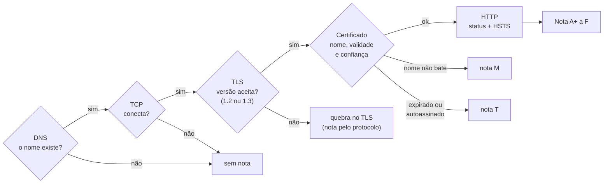

# Qual a nota do HTTPS do seu site?

> Reel: (link em breve)

Uma conexão HTTPS passa por cinco camadas: **DNS → TCP → TLS → Certificado → HTTP**. Se qualquer uma falha, o
navegador mostra um aviso (ou nem abre o site). O verificador deste exemplo percorre as camadas com `SslStream` e
validação X509 de verdade, mostra **onde** a conexão quebra e dá uma nota de **A+ a F** no estilo do guia de notas
do SSL Labs.

> **Laboratório local.** Cada caso é um servidor TLS em `127.0.0.1`, no mesmo processo, com um certificado gerado
> na hora por uma autoridade certificadora de laboratório. Os nomes são fictícios (`.invalid` e `.example`,
> inspirados nos casos de teste públicos do badssl.com) e o "DNS" é um dicionário. Nada sai da máquina. Veja
> [seguranca-didatica.md](../seguranca-didatica.md).

| | |
|---|---|
| Biblioteca | [`src/Enneal.Algoritmos.NotaTls`](../../src/Enneal.Algoritmos.NotaTls) |
| Exemplo | [`samples/nota-do-https`](../../samples/nota-do-https) |
| Testes | [`NotaTlsTests.cs`](../../tests/Enneal.Algoritmos.Tests/Algoritmos/NotaTlsTests.cs) |
| Notebook | [HTTPS Certificate & TLS Health Monitor](https://www.kaggle.com/code/edinaldos/https-tls-health-monitor-grades-net-worker) |

---

## Os 6 casos

| Caso | Servidor | O que tem de errado |
|------|----------|---------------------|
| 1 | `does-not-exist.invalid` | o nome não existe (`.invalid` é reservado e nunca resolve) |
| 2 | `tls-v1-0.lab.example` | só fala TLS 1.0 |
| 3 | `expired.lab.example` | certificado venceu em 2015 |
| 4 | `wrong.host.lab.example` | certificado de `*.lab.example`: não cobre dois níveis |
| 5 | `self-signed.lab.example` | certificado autoassinado |
| 6 | `seu-site.example` | tudo certo: TLS 1.2 + 1.3, cifras AEAD e HSTS de 365 dias |

## Como funciona



A **nota** soma 30% protocolo, 30% chave e 40% cifra, e depois aplica **tetos**:

| Situação | Teto |
|----------|------|
| Nem fala TLS 1.2 | C |
| Ainda aceita TLS 1.0 ou 1.1, ou sem sigilo futuro / sem AEAD | B |
| Sem TLS 1.3 ou sem HSTS | A- |
| A com HSTS de 180 dias ou mais | sobe para **A+** |
| Nome não bate / certificado sem confiança | **M** / **T** (no lugar da letra) |

## O código das camadas

```csharp
// 3) TLS: só TLS 1.2 e 1.3, como um cliente atual
await ssl.AuthenticateAsClientAsync(new SslClientAuthenticationOptions
{
    TargetHost = host,
    EnabledSslProtocols = SslProtocols.Tls12 | SslProtocols.Tls13,
});

// 4) Certificado: nome, validade e confiança, nessa ordem
if (erros.HasFlag(SslPolicyErrors.RemoteCertificateNameMismatch))
    return new ResultadoConexao("Certificado", "nome não bate com o site", true, protocolo, info);
if (cadeia.HasFlag(X509ChainStatusFlags.NotTimeValid))
    return new ResultadoConexao("Certificado", "expirado", true, protocolo, info);
if (cadeia.HasFlag(X509ChainStatusFlags.UntrustedRoot))
    return new ResultadoConexao("Certificado", "autoassinado", true, protocolo, info);
```

A cadeia é validada contra a AC do laboratório (`CustomRootTrust`) na **data do scan do notebook**
(04/10/2026 11:40:25 UTC), sem baixar nada e sem checar revogação: a saída é a mesma em qualquer dia.

## Complexidade

| Medida | Valor |
|--------|-------|
| Por site | 1 resolução + 1 conexão + 1 handshake + 1 GET |
| Nota | O(1) depois da conexão |

## Números do Reel

| Caso | Onde quebra | Nota | Pontos |
|------|-------------|------|-------:|
| 1 | DNS: nome não existe | sem nota | |
| 2 | TLS: versão recusada | **C** | 90,0 |
| 3 | Certificado: expirado | **T** (sem a confiança: A-) | 93,0 |
| 4 | Certificado: nome não bate | **M** (sem a confiança: A-) | 93,0 |
| 5 | Certificado: autoassinado | **T** (sem a confiança: A-) | 93,0 |
| 6 | chega no HTTP: 200, HSTS 365 dias | **A+** | 93,0 |

### No notebook (Tranco top 500, scan de 04/10/2026)

| Número | Valor |
|--------|------:|
| Domínios com handshake HTTPS completo | 336 de 500 |
| A+ | 125 |
| A | 20 |
| A- | 171 (157 só por falta de HSTS) |
| B | 6 |
| M (nome não bate) | 14 |

## Usando a biblioteca

```csharp
using Enneal.Algoritmos.NotaTls;

using var lab = new Laboratorio();                 // servidores TLS em 127.0.0.1
var verificador = new VerificadorTls(lab);
foreach (var s in ServidorDeTeste.CasosDoReel)
{
    lab.Subir(s);
    var q = await verificador.ChecarAsync(s.Host);
    if (q.Camada is not ("DNS" or "TCP"))
        Console.WriteLine($"{s.Host}: {NotaSslLabs.Calcular(s, q).Letra}");
}
```

## Como se defender

- **Só TLS 1.2 e 1.3.** No Kestrel: `o.ConfigureHttpsDefaults(h => h.SslProtocols = SslProtocols.Tls12 | SslProtocols.Tls13)`.
- **Certificado renovado sozinho** (ACME / Let's Encrypt ou o serviço do provedor) e um **alerta** 30 dias antes
  de vencer. O notebook mostra um Worker .NET que faz esse monitoramento.
- **O nome certo no certificado:** `*.exemplo.com` não cobre `a.b.exemplo.com`; liste todos os nomes no SAN.
- **Nunca autoassinado em produção** e nunca desligue a validação no cliente
  (`ServerCertificateCustomValidationCallback = (...) => true` é um furo, não uma correção).
- **HSTS** de pelo menos 180 dias (`app.UseHsts()`), depois de confirmar que todo o site funciona em HTTPS.
- **Cifras modernas** (AEAD, sigilo futuro) e chave RSA de 2048+ ou ECDSA.

## Exercícios

1. Adicione um caso com certificado que vence daqui a 10 dias e faça o verificador avisar.
2. Mude a data do scan para 2029 e veja quais casos mudam de nota.
3. Adicione o caso "TLS 1.2 sem HSTS" e confira que a nota fica A-.
