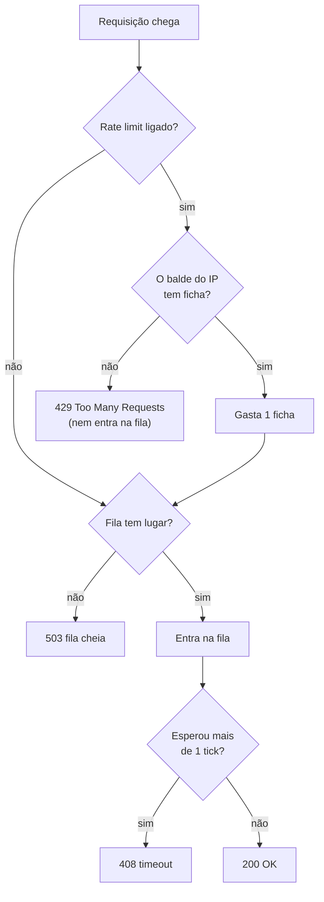

# Rate limit x DDoS: token bucket por IP

> Reel: (link em breve)

Uma enxurrada de requisições (como num ataque **DDoS**) lota a fila do servidor e quem é legítimo fica sem
resposta. Um **rate limit** com **token bucket** ("balde de fichas") por IP recusa o excesso logo na entrada,
e a fila volta a ter lugar para os usuários de verdade.

> **Simulação de brinquedo, para ensinar defesa.** Nada aqui gera tráfego de rede: as "requisições" são objetos
> numa lista, criados com semente fixa (2026). Veja [seguranca-didatica.md](../seguranca-didatica.md).

| | |
|---|---|
| Biblioteca | [`src/Enneal.Algoritmos.RateLimit`](../../src/Enneal.Algoritmos.RateLimit) |
| Exemplo | [`samples/rate-limit-token-bucket`](../../samples/rate-limit-token-bucket) |
| Testes | [`RateLimitTests.cs`](../../tests/Enneal.Algoritmos.Tests/Algoritmos/RateLimitTests.cs) |

---

## O cenário

| Parâmetro | Valor |
|-----------|-------|
| Capacidade do servidor | 10 requisições por tick |
| Fila de espera | 24 lugares; quem espera mais de 1 tick leva timeout |
| Usuários legítimos | 6, cada um manda 1 pedido por tick com 40% de chance |
| Enxurrada | a partir do tick 4, 12 IPs mandando 2 a 4 pedidos por tick cada |
| Token bucket (rodada 2) | 3 fichas por IP, recarga de 0,5 ficha por tick |

Respostas possíveis: **200** (atendida), **429** (passou da cota do IP), **503** (fila cheia) e **408** (timeout).

## Como funciona



1. Cada IP tem um balde que começa com **3 fichas** e ganha **0,5 ficha por tick**, até no máximo 3.
2. Cada requisição gasta **1 ficha**.
3. Sem ficha, a requisição volta na hora com **429** e **nem entra na fila**.

Assim um usuário normal pode fazer pequenas rajadas (até 3 pedidos seguidos), mas ninguém passa, no longo prazo,
de 1 pedido a cada 2 ticks.

## O código do token bucket

```csharp
public bool TentarConsumir(int tick)
{
    Fichas = Min(_capacidade, Fichas + (tick - _ultimoTick) * _recargaPorTick); // recarrega
    _ultimoTick = tick;

    if (Fichas < 1) return false; // balde vazio: recusa
    Fichas--;                     // gasta uma ficha
    return true;
}
```

## Complexidade

| Medida | Valor |
|--------|-------|
| Tempo por requisição | O(1) |
| Memória | O(número de clientes): um balde por IP |

## Números do Reel

| Rodada | Requisições | 200 | 429 | 503 | 408 | Legítimos atendidos |
|--------|------------:|----:|----:|----:|----:|--------------------:|
| Sem rate limit | 1.173 | 202 | 0 | 851 | 120 | 22/84 (**26%**) |
| Com token bucket | 1.173 | 268 | **886** | 14 | 5 | 81/84 (**96%**) |

O rate limit **não zera** a enxurrada: cada IP dela ainda consegue a sua cota, por isso o servidor continua
ocupado. O que muda é que o excesso volta no portão, a fila não lota e sobra lugar para quem é legítimo.

## Usando a biblioteca

```csharp
using Enneal.Algoritmos.RateLimit;

var balde = new TokenBucket(capacidade: 3, recargaPorTick: 0.5);
bool liberada = balde.TentarConsumir(tick: 0);

var r = SimulacaoRateLimit.Rodar(comLimite: true);
Console.WriteLine($"{r.PorcentagemLegitimasAtendidas}% atendidos, {r.Bloqueadas} bloqueadas"); // 96%, 886
```

## Como se defender

- **Rate limit por cliente** (IP, usuário ou chave de API) nas rotas públicas, principalmente login, cadastro, busca
  e APIs. No ASP.NET Core já existe pronto: `builder.Services.AddRateLimiter(...)` com `TokenBucketRateLimiter`
  ou `FixedWindowRateLimiter`.
- **Responda 429 com `Retry-After`**, para clientes bem-comportados saberem quando tentar de novo.
- **Corte cedo:** quanto mais na borda o excesso for barrado (CDN, proxy reverso, WAF), menos ele custa para a
  aplicação e para o banco.
- **Ataques grandes e distribuídos** (milhares de IPs) passam de qualquer limite por IP: use a proteção contra DDoS do
  provedor ou de uma CDN, que absorve o volume antes de chegar no seu servidor.
- **Filas e timeouts limitados:** fila infinita só transforma sobrecarga em lentidão para todo mundo.
- **Monitore** a taxa de 429, 503 e o tempo de resposta, e tenha alertas para picos fora do normal.
