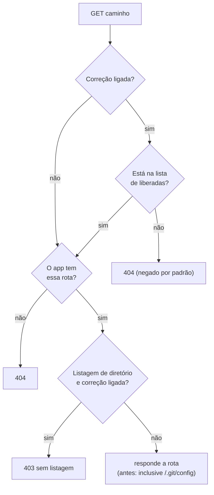

# Rotas esquecidas no seu site: negar por padrão

> Reel: (link em breve)

Antes do deploy, você confere as rotas do **seu próprio site** com um checklist. Quase tudo responde como deveria,
mas uma sobra do deploy, `/.git/config`, responde **200** e expõe o repositório (histórico, endereço do remoto e, às
vezes, credenciais esquecidas). A correção é inverter a lógica: **negar por padrão** e liberar só as rotas da lista.

> **Auditoria local e defensiva.** O "servidor" é a tabela de rotas do app, em memória, com dados fixos
> (`seu-site.example`). Nada aqui gera tráfego de rede e o checklist tem 15 caminhos conhecidos de configuração
> comum, não uma lista de varredura. Audite só sites seus. Veja [seguranca-didatica.md](../seguranca-didatica.md).

| | |
|---|---|
| Biblioteca | [`src/Enneal.Algoritmos.RotasEsquecidas`](../../src/Enneal.Algoritmos.RotasEsquecidas) |
| Exemplo | [`samples/rotas-esquecidas`](../../samples/rotas-esquecidas) |
| Testes | [`RotasEsquecidasTests.cs`](../../tests/Enneal.Algoritmos.Tests/Algoritmos/RotasEsquecidasTests.cs) |

---

## O cenário

| Parâmetro | Valor |
|-----------|-------|
| Rotas que o app tem | 8 (páginas, API de status, `/admin` com login, `/uploads/` com listagem aberta, `/.git/config`) |
| Rotas liberadas (lista do app) | 6: `/`, `/login`, `/robots.txt`, `/admin`, `/api/status`, `/uploads/` |
| Checklist da auditoria | 15 caminhos (as rotas do app e arquivos que costumam sobrar: `.env`, `db.sql`, `backup/`...) |

Uma rota é **exposta** quando responde 200 com conteúdo sensível.

## Como funciona



## O código da correção

```csharp
public Rota Responder(string caminho, bool corrigido)
{
    if (corrigido && !_liberadas.Contains(caminho))
        return new Rota(404, "negado-padrao", false);  // não está na lista: não existe
    if (!_rotas.TryGetValue(caminho, out var r))
        return new Rota(404, "nao-existe", false);
    if (corrigido && r.Tipo == "listagem")
        return new Rota(403, "sem-listagem", false);   // listagem de diretório desligada
    return r;                                          // antes: entrega o que achar
}
```

## Complexidade

| Medida | Valor |
|--------|-------|
| Tempo por rota | O(1) (dois conjuntos com hash) |
| Auditoria | O(tamanho do checklist) |

## Números do Reel

| Rodada | Conferidas | 200 | 302 | 403 | 404 | Rotas sensíveis expostas |
|--------|-----------:|----:|----:|----:|----:|-------------------------:|
| Antes da correção | 15 | 6 | 1 | 1 | 7 | **1** (`/.git/config`) |
| Depois da correção | 15 | 4 | 1 | 1 | 9 | **0** |

Depois da correção, `/.git/config` vira 404 (não está na lista) e `/uploads/` vira 403 (sem listagem): por isso
os 200 caem de 6 para 4.

## Usando a biblioteca

```csharp
using Enneal.Algoritmos.RotasEsquecidas;

var site = SiteDeExemplo.DoReel();
var r = AuditoriaDeRotas.Auditar(site, AuditoriaDeRotas.ChecklistDoReel, corrigido: false);
Console.WriteLine($"{r.Contar(200)} com 200, expostas: {string.Join(", ", r.Expostas)}"); // 6, /.git/config
```

## Como se defender

- **Publique só a saída do build** (`dotnet publish`), nunca a pasta do repositório. `.git/`, `.env`, backups e
  dumps não devem nem chegar ao servidor.
- **Negue por padrão:** no ASP.NET Core, só o que está em `wwwroot` é arquivo estático; não aponte
  `UseStaticFiles` para a raiz do projeto e use `FallbackPolicy` de autorização para exigir login onde não houver
  regra explícita.
- **Desligue a listagem de diretório** (`UseDirectoryBrowser` só em desenvolvimento, se tanto).
- **Endpoints de diagnóstico** (`/debug`, `/server-status`, Swagger) só em desenvolvimento ou atrás de autenticação.
- **Automatize a auditoria no pipeline:** depois do deploy em homologação, confira o checklist e falhe o build se
  algo sensível responder 200. É o `AuditoriaDeRotas` deste exemplo.
- **Se um segredo vazou, troque o segredo.** Apagar o arquivo não desfaz o vazamento.

## Exercícios

1. Adicione `/swagger` ao app e decida: liberar só em desenvolvimento ou exigir login?
2. Faça a auditoria aceitar um `IReadOnlyList<string>` vindo de um arquivo do seu projeto e rode no CI.
3. Escreva um teste que falha se qualquer rota fora da lista de liberadas responder diferente de 404.
