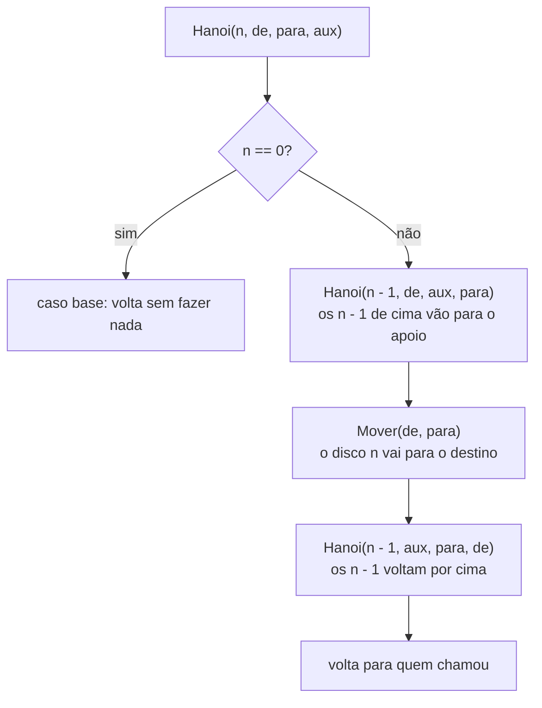
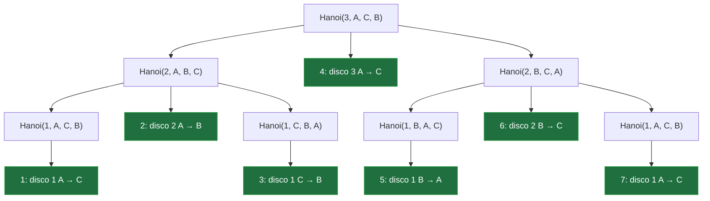

# Torre de Hanói (recursão)

> Reel: (link em breve)

Três pinos e uma torre de discos no pino A, do maior (embaixo) para o menor (em cima). O objetivo é levar a torre
inteira para o pino C seguindo duas regras: **um disco por vez** e **nunca um disco maior sobre um menor**. O pino B
serve de apoio. Parece um quebra-cabeça, mas é o exemplo clássico de **recursão**: o problema se resolve usando a
solução de um problema igual, só que menor.

| | |
|---|---|
| Biblioteca | [`src/Enneal.Algoritmos.TorreHanoi`](../../src/Enneal.Algoritmos.TorreHanoi) |
| Exemplo | [`samples/torre-de-hanoi`](../../samples/torre-de-hanoi) |
| Testes | [`TorreHanoiTests.cs`](../../tests/Enneal.Algoritmos.Tests/Algoritmos/TorreHanoiTests.cs) |

---

## Como funciona

Para mover `n` discos de `de` para `para`, usando `aux` como apoio:

1. mova os `n - 1` discos de cima de `de` para `aux` (o mesmo problema, com um disco a menos);
2. mova o disco `n`, o maior desta chamada, de `de` para `para`;
3. mova os `n - 1` discos de `aux` para `para`, por cima dele (de novo o mesmo problema).

Quando `n` é 0 não há nada a fazer: é o **caso base**, que faz a recursão parar.



Repare que os papéis dos pinos **trocam a cada nível**: o pino que é `para` numa chamada vira `aux` na chamada de
baixo. É isso que o Reel mostra embaixo de cada pino.

### A árvore de chamadas com 3 discos

Cada chamada com `n > 0` faz duas chamadas menores e **um** movimento (o número em verde é a ordem do movimento).
As chamadas com `n = 0` (caso base) foram omitidas.



Lendo os movimentos em ordem (1 a 7): `A→C, A→B, C→B, A→C, B→A, B→C, A→C`. Os testes conferem essa sequência exata.

## O código do Reel

```csharp
void Hanoi(int n, char de, char para, char aux) {
  if (n == 0) return;             // caso base
  Hanoi(n - 1, de, aux, para);    // n-1 pro aux
  Mover(de, para);                // o disco n
  Hanoi(n - 1, aux, para, de);    // n-1 por cima
}

void Mover(char de, char para) {
  pino[para].Push(pino[de].Pop());
  movimentos++;
}
```

Cada pino é uma `Stack<int>`: só dá para mexer no disco do topo, exatamente como no jogo. Na biblioteca, o
`Pinos.Mover` faz o mesmo `Push(Pop())`, mas antes confere a regra e dá erro se um disco maior fosse parar sobre um
menor. Com a recursão certa, esse erro nunca acontece.

## Por que 2ⁿ − 1

Chame de `T(n)` o número de movimentos para `n` discos. A recursão faz `T(n - 1)` movimentos, mais 1, mais
`T(n - 1)` de novo:

| n | T(n) = 2 · T(n − 1) + 1 | 2ⁿ − 1 |
|--:|------------------------:|-------:|
| 0 | 0 (caso base) | 0 |
| 1 | 2 · 0 + 1 = 1 | 1 |
| 2 | 2 · 1 + 1 = 3 | 3 |
| 3 | 2 · 3 + 1 = **7** | 7 |
| 4 | 2 · 7 + 1 = **15** | 15 |
| 5 | 2 · 15 + 1 = 31 | 31 |
| 6 | 2 · 31 + 1 = **63** | 63 |

Cada disco a mais **dobra** o trabalho (e soma 1). E não existe jeito mais curto: o maior disco precisa se mover
pelo menos uma vez, e para isso os outros `n - 1` precisam estar todos no pino de apoio, antes e depois.

## Complexidade

| | Custo |
|---|---|
| Movimentos | exatamente 2ⁿ − 1, O(2ⁿ) |
| Tempo | O(2ⁿ): um movimento por chamada com `n > 0` |
| Memória | O(n): a pilha de chamadas tem no máximo `n + 1` chamadas abertas ao mesmo tempo |

## Números do Reel

| Rodada | Discos | Movimentos |
|--------|-------:|-----------:|
| 1 (devagar) | 3 | 7 |
| 2 | 4 | 15 = 2 × 7 + 1 |
| 3 (modo turbo) | 6 | 63 |
| a lenda | 64 | **18.446.744.073.709.551.615** |

Com 64 discos, a 1 movimento por segundo: **584.542.046.090 anos** (≈ 585 bilhões de anos), usando anos de
365,25 dias (31.557.600 segundos). O universo tem uns 13,8 bilhões de anos.

O número 2⁶⁴ − 1 não cabe num `long` (máximo 2⁶³ − 1), por isso o código usa `UInt128`:

```csharp
UInt128 total = (UInt128.One << 64) - 1;   // 18.446.744.073.709.551.615
UInt128 anos  = total / 31_557_600;        // 584.542.046.090
```

## Usando a biblioteca

```csharp
using Enneal.Algoritmos.TorreHanoi;

var r = ResolvedorHanoi.Resolver(4);                       // 15 movimentos, r.Resolvida == true

ResolvedorHanoi.Resolver(3, m => Console.WriteLine(m));    // disco 1: A -> C, disco 2: A -> B, ...

UInt128 total = ContaDeHanoi.MovimentosNecessarios(64);    // 18446744073709551615
UInt128 anos = ContaDeHanoi.AnosAUmMovimentoPorSegundo(total); // 584542046090
```

`ResolvedorHanoi.Resolver` move os discos de verdade (até 30 discos); `ContaDeHanoi` só faz a conta (até 128).

## Para praticar

- Mude o programa para mostrar a torre desenhada no terminal depois de cada movimento.
- Escreva a versão **sem recursão**: o disco 1 se move em todo movimento ímpar, sempre girando no mesmo sentido
  (A → C → B → A com `n` ímpar); nos movimentos pares, só existe um movimento válido que não usa o disco 1.
  Os testes conferem essa propriedade.
- Conte quantas vezes cada disco se move (dica: o disco `k` se move 2ⁿ⁻ᵏ vezes).
- Quantos discos dá para resolver em 1 segundo no seu computador? E em 1 minuto?
