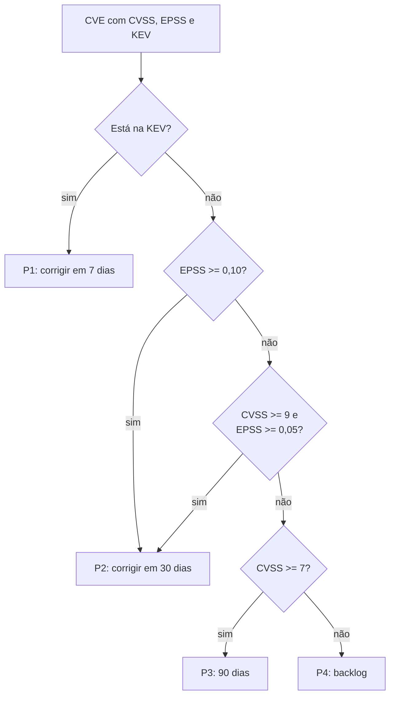

# CVSS alto não é explorada: triagem com CVSS x EPSS x KEV

> Reel: (link em breve)

A fila de correção do time costuma ser "maior CVSS primeiro". Só que **CVSS mede gravidade, não chance de ataque**.
Com a mesma fila de 400 CVEs públicas, as 3 que **já estão sendo exploradas** (catálogo KEV da CISA) aparecem em
**#9, #10 e #24** pelo CVSS. Somando a probabilidade de exploração (EPSS, da FIRST), sobem para #1, #2 e #19. Com a
triagem que usa a KEV, ficam em **#1, #2 e #3**.

> **Priorização defensiva, com dados públicos.** A fila é um CSV de 400 CVEs com notas públicas da NVD, da FIRST
> (EPSS) e da CISA (KEV); a coluna de serviço é simulada, com nomes fictícios. Nada aqui gera tráfego de rede.
> Fontes e atribuição em [`dados/README.md`](../../src/Enneal.Algoritmos.TriagemVulnerabilidades/dados/README.md).

| | |
|---|---|
| Biblioteca | [`src/Enneal.Algoritmos.TriagemVulnerabilidades`](../../src/Enneal.Algoritmos.TriagemVulnerabilidades) |
| Exemplo | [`samples/triagem-cvss-epss-kev`](../../samples/triagem-cvss-epss-kev) |
| Testes | [`TriagemVulnerabilidadesTests.cs`](../../tests/Enneal.Algoritmos.Tests/Algoritmos/TriagemVulnerabilidadesTests.cs) |
| Notebook | [High CVSS ≠ Exploited: CVSS, EPSS & KEV](https://www.kaggle.com/code/edinaldos/high-cvss-exploited-cvss-epss-kev-vulnerabil) |

---

## Os três sinais

| Sinal | Pergunta que responde | Escala |
|-------|-----------------------|--------|
| **CVSS** (NVD) | Se for explorada, quão grave é? | 0 a 10 |
| **EPSS** (FIRST) | Qual a chance de ser explorada nos próximos 30 dias? | 0 a 1 |
| **KEV** (CISA) | Já existe exploração confirmada? | sim ou não (+ uso em ransomware) |

## Como funciona



Dentro de cada faixa, a fila segue o **risco** de 0 a 100:

```
chance  = 1 se está na KEV, senão raiz(EPSS)       (a raiz "abre" os EPSS pequenos)
risco   = 100 x (0,65 x chance + 0,35 x CVSS/10)   (+5 se a KEV marca uso em ransomware)
```

## O código da triagem

```csharp
public static string Faixa(Achado a) =>
    a.Kev ? "P1"
    : a.Epss >= 0.10 ? "P2"
    : a.Cvss >= 9 && a.Epss >= 0.05 ? "P2"
    : a.Cvss >= 7 ? "P3"
    : "P4";

public static List<Achado> Triada(IEnumerable<Achado> achados) =>
    [.. achados.OrderBy(Triagem.Faixa, StringComparer.Ordinal)
        .ThenByDescending(Triagem.Risco)
        .ThenByDescending(a => a.Epss)];
```

## Complexidade

| Medida | Valor |
|--------|-------|
| Risco e faixa de uma CVE | O(1) |
| Montar a fila | O(n log n) (uma ordenação) |

## Números do Reel

| Ordem da fila | Posição das 3 CVEs exploradas |
|---------------|-------------------------------|
| 1) CVSS primeiro | #9, #10, #24 |
| 2) CVSS + EPSS | #1, #2, #19 |
| 3) Triagem com KEV | **#1, #2, #3** |

| Faixa | P1 (7 dias) | P2 (30 dias) | P3 (90 dias) | P4 |
|-------|------------:|-------------:|-------------:|---:|
| CVEs | 3 | 5 | 197 | 195 |

"Corrigir tudo com CVSS ≥ 9 primeiro" coloca **31** CVEs no topo; a triagem põe **8** (P1 + P2), e as 3
exploradas estão entre elas. O exemplo também confere a conta com as colunas que o notebook calculou:
risco 400/400, faixa 400/400 e a mesma ordem.

### No catálogo inteiro (notebook)

| Número | Valor |
|--------|-------|
| CVEs analisadas | 372.514 |
| Na KEV (catálogo 2026.10.02) | 1.733 (0,47%) |
| CVEs da KEV com CVSS **abaixo** de 9 | 1.113 (64,2%) |
| CVEs com CVSS ≥ 9 que estão na KEV | 1,32% de 46.960 |
| Com o mesmo esforço de "corrigir todo CVSS ≥ 9", parte da KEV coberta | CVSS 35,8% · EPSS 86,7% · CVSS+EPSS 84,1% |

## Usando a biblioteca

```csharp
using Enneal.Algoritmos.TriagemVulnerabilidades;

var fila = FilaDeDemonstracao.Carregar();            // as 400 CVEs do notebook (embutidas)
var triada = FilaDeRemediacao.Triada(fila);
Console.WriteLine(string.Join(", ", FilaDeRemediacao.PosicoesDasExploradas(triada))); // 1, 2, 3

var a = triada[0];
Console.WriteLine($"{a.Cve} risco {Triagem.Risco(a)} {Triagem.Faixa(a)}");          // ... risco 100.0 P1
```

## Como se defender

- **Use os três sinais juntos:** KEV primeiro (exploração confirmada), depois EPSS alto, e o CVSS para desempatar
  e medir impacto.
- **Prazos por faixa** (aqui 7, 30 e 90 dias) e acompanhamento do que estourou o prazo.
- **Contexto do seu ambiente:** um serviço exposto na internet sobe na fila; um sistema isolado pode descer.
- **Atualize os dados com frequência:** o EPSS muda todo dia e a KEV ganha CVEs toda semana.
- **Inventário (SBOM) e varredura de dependências** (`dotnet list package --vulnerable`, Dependabot) para saber
  quais CVEs afetam você de fato.

## Exercícios

1. Mude o peso 0,65/0,35 e veja em que ponto as exploradas saem do top 3.
2. Adicione um campo "exposto na internet" ao `Achado` e faça ele subir uma faixa.
3. Calcule o prazo de cada CVE a partir de uma data (o notebook usou 05/10/2026: P1 até 12/10, P2 até 04/11).
