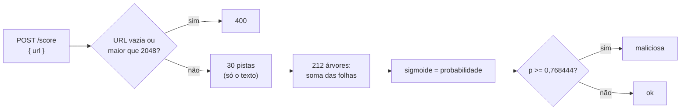

# URL maliciosa ou não?

> Reel: (link em breve)

Dá para desconfiar de uma URL **sem abrir**: tamanho, IP no lugar do nome, `@` escondendo o destino, punycode,
extensão `.exe`, muitos subdomínios... Este exemplo extrai **30 pistas léxicas** do texto da URL e passa para o
modelo de árvores (LightGBM, 212 árvores) treinado no notebook, servido por uma **minimal API do ASP.NET Core 8**
(`POST /score`). Quatro das seis URLs são marcadas. A URL 6, um phishing "limpo", passa. Nenhum modelo pega tudo.

> **Só localhost, e a URL nunca é acessada.** A API sobe em `127.0.0.1` numa porta livre, dentro do processo, e
> o classificador só lê o texto. As URLs de exemplo usam nomes e IPs reservados para documentação
> (`example.com/.net/.org`, RFC 2606; `198.51.100.0/24` e `203.0.113.0/24`, RFC 5737). Veja
> [seguranca-didatica.md](../seguranca-didatica.md).

| | |
|---|---|
| Biblioteca | [`src/Enneal.Algoritmos.UrlMaliciosa`](../../src/Enneal.Algoritmos.UrlMaliciosa) |
| Exemplo | [`samples/url-maliciosa`](../../samples/url-maliciosa) |
| Testes | [`UrlMaliciosaTests.cs`](../../tests/Enneal.Algoritmos.Tests/Algoritmos/UrlMaliciosaTests.cs) |
| Notebook | [Malicious URL Classifier → ONNX → ASP.NET Core 8](https://www.kaggle.com/code/edinaldos/malicious-url-classifier-onnx-asp-net-core-8) |

---

## O modelo

| Item | Valor |
|------|-------|
| Arquivo | [`modelo/url_model.onnx`](../../src/Enneal.Algoritmos.UrlMaliciosa/modelo) (984 KB, o mesmo do notebook, sem mudança) |
| Tipo | `TreeEnsembleClassifier` (ONNX-ML): 212 árvores, 26.500 nós, saída logística |
| Pistas | 30, versão `url-lexical-v2` (nomes em `model_meta.json`) |
| Limiar | 0,768444 (escolhido no notebook para ~1% de falso positivo na validação) |
| Treino | dataset público *Malicious URLs* (Kaggle `sid321axn/malicious-urls-dataset`, licença CC0), separado por host |

O `.onnx` é lido e avaliado **em C# puro** (um leitor de protobuf de ~80 linhas e um laço por árvore), sem
ONNX Runtime e sem pacote NuGet. Os testes conferem as pistas e a probabilidade contra os 9 casos que o notebook
salvou com o ONNX Runtime.

## Como funciona



Algumas pistas: tamanho da URL e do host, pontos e hífens no host, host é IPv4, tem porta, tem `@`, quantidade de
parâmetros, `%` e caracteres especiais, proporção de dígitos e maiúsculas, entropia, TLD suspeito, palavras como
`login` e `verify`, punycode (`xn--`), encurtador, profundidade do caminho, extensão `.exe`/`.php`/`.html`,
subdomínios.

## O código da avaliação

```csharp
double soma = 0;
foreach (int raiz in _raizes)
{
    int i = raiz;
    while (!_folha[i])                       // desce a árvore até uma folha
    {
        float x = pistas[_pista[i]];
        bool vaiSim = x <= _limite[i] || (float.IsNaN(x) && _faltaVaiSim[i]);
        i = vaiSim ? _sim[i] : _nao[i];
    }
    soma += _peso[i];
}
return (float)(1.0 / (1.0 + Math.Exp(-soma))); // função logística: soma -> probabilidade
```

## Complexidade

| Medida | Valor |
|--------|-------|
| Pistas | O(tamanho da URL) |
| Modelo | O(árvores x profundidade): no máximo algumas milhares de comparações |
| Memória | os 26.500 nós em arrays (~1 MB) |

## Números do Reel

| URL | Rótulo | Probabilidade | Veredito |
|-----|--------|--------------:|----------|
| 1 `https://www.example.com/produtos/tenis-corrida` | normal | 0,165815 | ok (acertou) |
| 2 `https://banco.example.com@198.51.100.23/login/verify` | phishing | 0,981784 | maliciosa (acertou) |
| 3 `http://xn--bnco-0qa.example.com.login.conta.example.net` | phishing | 0,980968 | maliciosa (acertou) |
| 4 `http://203.0.113.7:8080/bin/update.exe` | malware | 0,999031 | maliciosa (acertou) |
| 5 `http://escola.example.org/index.php?option=com_content&...` | defacement | 0,849362 | maliciosa (acertou) |
| 6 `https://login-banco.example.com/` | phishing | 0,107498 | **ok (errou)** |

E a URL vazia volta **400**.

### No notebook (conjunto de teste, separado por host)

| Número | Valor |
|--------|------:|
| URLs de teste | 103.365 (29.082 hosts) |
| ROC-AUC | 0,9065 |
| Precisão no limiar | 91,1% |
| Falso positivo | 1,8% |
| Marcadas por tipo | malware 80,4% · defacement 60,9% · phishing 32,0% · normais 1,8% |
| Tempo com ONNX Runtime (lote 1, CPU) | mediana 12 µs, p99 22 µs |

O phishing é o mais difícil: muitas páginas falsas têm URLs curtas e "limpas", como a URL 6.

## Usando a biblioteca

```csharp
using Enneal.Algoritmos.UrlMaliciosa;

var a = ClassificadorDeUrl.Avaliar("http://203.0.113.7:8080/bin/update.exe");
Console.WriteLine($"{a.Probabilidade:0.000000} {a.Veredito}"); // 0.999031 maliciosa
```

## Como se defender

- **Use como uma camada, nunca como a única.** Combine com listas de bloqueio mantidas (por exemplo Google Safe
  Browsing ou o filtro do seu provedor de e-mail) e com a reputação do domínio.
- **Escolha o limiar pelo custo do erro:** aqui ele foi escolhido para ~1% de falso positivo; um filtro de e-mail
  pode preferir marcar mais e mandar para quarentena.
- **Valide a entrada da API** (vazia, tamanho máximo) e **nunca acesse a URL recebida** no servidor de
  classificação (evita SSRF).
- **Versione as pistas junto com o modelo** (`url-lexical-v2`): treinar com uma regra e servir com outra dá
  resultados errados sem nenhum erro aparente.
- **Para usuários:** desconfie de `@` na URL, IP no lugar do nome, punycode e "login/verify" em domínios estranhos;
  digite o endereço do banco em vez de clicar.
- **Monitore e re-treine:** quem faz phishing muda de padrão; acompanhe os erros reportados.

## Exercícios

1. Encontre o limiar que marca a URL 6 e veja quais URLs normais passam a ser marcadas também.
2. Crie uma URL `https://www.example.com/` bem longa, com 20 parâmetros, e veja a probabilidade subir.
3. Troque a pista "TLD suspeito" para sempre 0 e meça quanto a probabilidade das URLs do Reel muda.
