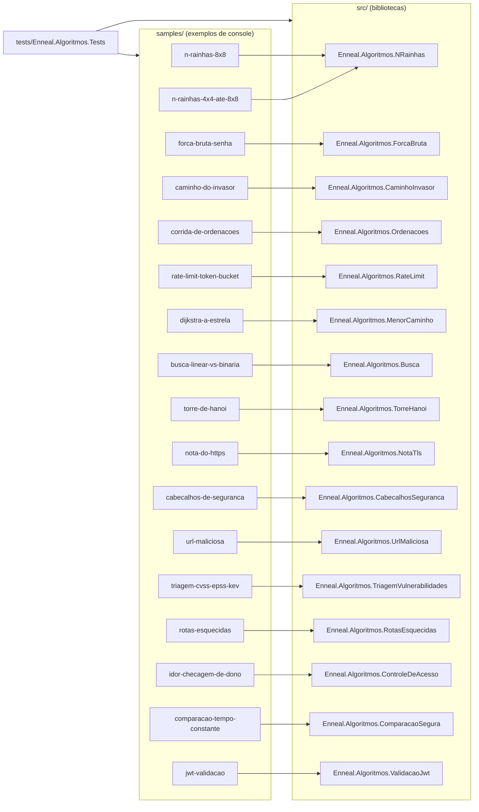

# Arquitetura

## Visão geral

O repositório separa cada algoritmo em três partes:

1. **Biblioteca** (`src/`): o algoritmo puro, sem `Console`, devolvendo resultados e contadores. É o código para
   estudar e reaproveitar.
2. **Exemplo** (`samples/`): um programa de console pequeno que chama a biblioteca e imprime os **mesmos números
   do Reel**, com desenhos no terminal.
3. **Testes** (`tests/`): conferem os números exatos dos Reels, propriedades dos algoritmos e a saída completa de
   cada exemplo.

## Projetos

| Projeto | Tipo | Responsabilidade |
|---------|------|------------------|
| `Enneal.Algoritmos.NRainhas` | biblioteca | backtracking das N rainhas: primeira solução, tentativas, voltas, contagem de soluções |
| `Enneal.Algoritmos.ForcaBruta` | biblioteca | `LoginProtegido` (PBKDF2 + salt + bloqueio) e a simulação didática do PIN de 4 dígitos |
| `Enneal.Algoritmos.CaminhoInvasor` | biblioteca | busca em largura num mapa abstrato e os dois mapas do Reel |
| `Enneal.Algoritmos.Ordenacoes` | biblioteca | Bubble, Quick e Merge Sort com `ContadorDePassos` e a corrida |
| `Enneal.Algoritmos.RateLimit` | biblioteca | `TokenBucket` e a simulação da fila do servidor |
| `Enneal.Algoritmos.MenorCaminho` | biblioteca | Dijkstra e A\* num mapa em grade com pesos |
| `Enneal.Algoritmos.Busca` | biblioteca | busca linear e binária, gerador do vetor e medição de escala |
| `Enneal.Algoritmos.TorreHanoi` | biblioteca | recursão da Torre de Hanói, pinos que conferem a regra e a conta 2ⁿ − 1 com `UInt128` |
| `Enneal.Algoritmos.NotaTls` | biblioteca | laboratório TLS em `127.0.0.1` (AC e certificados gerados na hora), verificador por camadas e a nota no estilo do SSL Labs |
| `Enneal.Algoritmos.CabecalhosSeguranca` | biblioteca | loja ASP.NET Core 8 por fases, GET em memória no pipeline e o avaliador de cabeçalhos (160 pontos, tetos e avisos) |
| `Enneal.Algoritmos.UrlMaliciosa` | biblioteca | as 30 pistas léxicas, leitor de protobuf e avaliador das árvores do `url_model.onnx` (embutido) |
| `Enneal.Algoritmos.TriagemVulnerabilidades` | biblioteca | risco e faixa P1-P4 com CVSS, EPSS e KEV, as três ordens da fila e a fila de 400 CVEs (CSV embutido) |
| `Enneal.Algoritmos.RotasEsquecidas` | biblioteca | tabela de rotas do site de exemplo, negar por padrão e a auditoria do checklist |
| `Enneal.Algoritmos.ControleDeAcesso` | biblioteca | API de pedidos em memória com e sem checagem de dono e o teste de acesso |
| `Enneal.Algoritmos.ComparacaoSegura` | biblioteca | laço que sai cedo, `FixedTimeEquals`, o modelo do que ele faz por dentro e o contador de comparações |
| `Enneal.Algoritmos.ValidacaoJwt` | biblioteca | emissão HS256, validação frouxa x certa (JwtBearer), tokens de teste negativo e a API de teste em `127.0.0.1` |
| `samples/*` | console | um programa por Reel, com a saída esperada em `saida-esperada.txt` |
| `Enneal.Algoritmos.Tests` | xUnit | números dos Reels, propriedades e saída dos exemplos |

Todos usam **.NET 8**, C# 12 e `Nullable` ligado. Pacotes externos: só o xUnit nos testes e o
`Microsoft.AspNetCore.Authentication.JwtBearer` (oficial da Microsoft) na biblioteca de JWT, porque configurá-lo é o
assunto do Reel. Os projetos de
cabeçalhos, da URL e do JWT referenciam o ASP.NET Core 8 com `<FrameworkReference Include="Microsoft.AspNetCore.App" />`:
ele faz parte do .NET 8 SDK, não é pacote NuGet.

## Decisões

- **Mesmo algoritmo do Reel.** A biblioteca mantém a lógica e a ordem das operações do código mostrado no vídeo
  (ordem dos vizinhos, critério de desempate, contagem de passos). Por isso os números batem exatamente.
- **Bibliotecas sem `Console`.** Os algoritmos devolvem `record`s com resultados e contadores; quem imprime é o
  exemplo. Isso deixa o código testável e reaproveitável.
- **Saída dourada.** Cada exemplo tem um `saida-esperada.txt`. O teste `SaidaDosExemplosTests` roda o programa e
  compara caractere por caractere: qualquer mudança nos números quebra o build.
- **Comentários em português.** Comentários `///` em todos os membros públicos (o build gera a documentação XML
  e mostra no IntelliSense) e comentários de linha explicando o porquê de cada passo.
- **Relógio fixo só no teste.** Os tokens JWT do exemplo são emitidos num instante fixo; só a API de teste confere a
  validade nesse relógio (`CertaNoRelogio`). A configuração para produção (`Certa`) não mexe no relógio.
- **Saída igual em qualquer máquina.** `InvariantGlobalization` (ponto como separador decimal) e sementes fixas em
  tudo que é pseudoaleatório. O laboratório TLS valida os certificados numa data fixa (a do scan do notebook), e
  as portas são livres, escolhidas pelo sistema.
- **Dados e modelos dos notebooks sem mudança.** A fila de CVEs e o `url_model.onnx` são os arquivos que os
  notebooks geraram, embutidos na DLL (`EmbeddedResource`), com fonte e licença ao lado. Os testes conferem a
  paridade com as colunas e os casos que os notebooks salvaram.
- **Sem pacote para o modelo.** O `.onnx` é avaliado em C# puro (um laço por árvore), em vez de puxar o
  ONNX Runtime, que é um pacote nativo de centenas de MB.
- **Segurança didática.** Os temas de segurança são simulações, auditorias e laboratórios fechados no próprio
  processo (sockets só em `127.0.0.1`). Veja
  [seguranca-didatica.md](seguranca-didatica.md).

## Configuração do build

| Arquivo | Papel |
|---------|-------|
| `Directory.Build.props` | .NET 8, C# 12, `Nullable`, `ImplicitUsings`, versão, autor e licença para todos os projetos |
| `src/Directory.Build.props` | bibliotecas: gera documentação XML (todo membro público precisa de `///`) |
| `samples/Directory.Build.props` | exemplos: `OutputType` Exe |
| `tests/Directory.Build.props` | marca o projeto de testes |
| `Directory.Packages.props` | versões centrais dos pacotes NuGet (xUnit, o SDK de testes e o JwtBearer) |
| `global.json` | SDK mínimo 8.0.100 (aceita versões mais novas) |
| `.editorconfig` | estilo: UTF-8, LF, 4 espaços |

## Pontos de extensão

- **Novo algoritmo:** biblioteca em `src/`, exemplo em `samples/`, testes em `tests/` e documentação em
  `docs/algoritmos/`. O passo a passo está em [CONTRIBUTING.md](../CONTRIBUTING.md).
- **Novos mapas:** `BuscaInvasor.Invadir` e `BuscaDeRota.Dijkstra`/`AEstrela` aceitam qualquer mapa retangular.
- **Novos competidores na corrida:** qualquer ordenação que use o `ContadorDePassos`.
- **Novos cenários de tráfego:** `ConfiguracaoSimulacao` com `with { ... }`.
