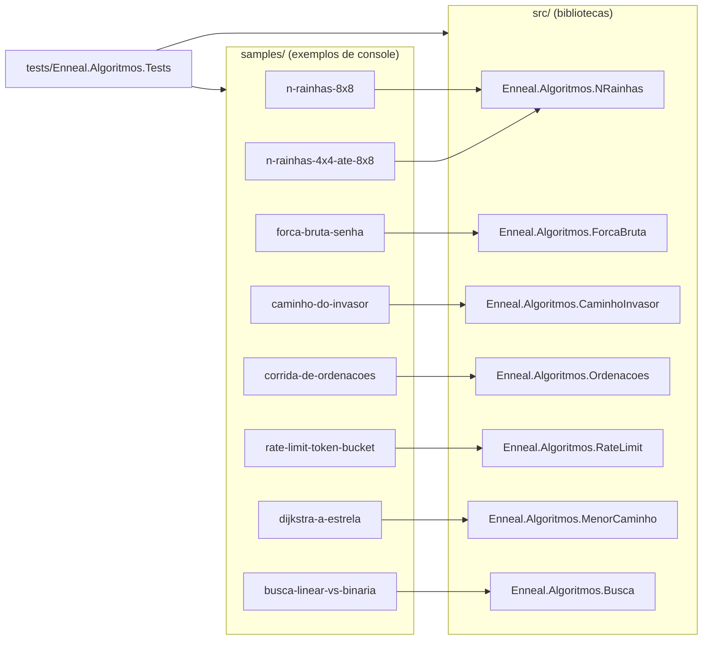

# Arquitetura

## Visão geral

O repositório separa cada algoritmo em três partes:

1. **Biblioteca** (`src/`): o algoritmo puro, sem `Console`, devolvendo resultados e contadores. É o código para
   estudar e reaproveitar.
2. **Exemplo** (`samples/`): um programa de console pequeno que chama a biblioteca e imprime os **mesmos números
   do Reel**, com desenhos no terminal.
3. **Testes** (`tests/`): conferem os números exatos dos Reels, propriedades dos algoritmos e a saída completa de
   cada exemplo.

## Projetos

| Projeto | Tipo | Responsabilidade |
|---------|------|------------------|
| `Enneal.Algoritmos.NRainhas` | biblioteca | backtracking das N rainhas: primeira solução, tentativas, voltas, contagem de soluções |
| `Enneal.Algoritmos.ForcaBruta` | biblioteca | `LoginProtegido` (PBKDF2 + salt + bloqueio) e a simulação didática do PIN de 4 dígitos |
| `Enneal.Algoritmos.CaminhoInvasor` | biblioteca | busca em largura num mapa abstrato e os dois mapas do Reel |
| `Enneal.Algoritmos.Ordenacoes` | biblioteca | Bubble, Quick e Merge Sort com `ContadorDePassos` e a corrida |
| `Enneal.Algoritmos.RateLimit` | biblioteca | `TokenBucket` e a simulação da fila do servidor |
| `Enneal.Algoritmos.MenorCaminho` | biblioteca | Dijkstra e A\* num mapa em grade com pesos |
| `Enneal.Algoritmos.Busca` | biblioteca | busca linear e binária, gerador do vetor e medição de escala |
| `samples/*` | console | um programa por Reel, com a saída esperada em `saida-esperada.txt` |
| `Enneal.Algoritmos.Tests` | xUnit | números dos Reels, propriedades e saída dos exemplos |

Todos usam **.NET 8**, C# 12, `Nullable` ligado e nenhum pacote externo (só os testes usam xUnit).

## Decisões

- **Mesmo algoritmo do Reel.** A biblioteca mantém a lógica e a ordem das operações do código mostrado no vídeo
  (ordem dos vizinhos, critério de desempate, contagem de passos). Por isso os números batem exatamente.
- **Bibliotecas sem `Console`.** Os algoritmos devolvem `record`s com resultados e contadores; quem imprime é o
  exemplo. Isso deixa o código testável e reaproveitável.
- **Saída dourada.** Cada exemplo tem um `saida-esperada.txt`. O teste `SaidaDosExemplosTests` roda o programa e
  compara caractere por caractere: qualquer mudança nos números quebra o build.
- **Comentários em português.** Comentários `///` em todos os membros públicos (o build gera a documentação XML
  e mostra no IntelliSense) e comentários de linha explicando o porquê de cada passo.
- **Saída igual em qualquer máquina.** `InvariantGlobalization` (ponto como separador decimal) e sementes fixas em
  tudo que é pseudoaleatório.
- **Segurança didática.** Os temas de segurança são simulações fechadas no próprio processo. Veja
  [seguranca-didatica.md](seguranca-didatica.md).

## Configuração do build

| Arquivo | Papel |
|---------|-------|
| `Directory.Build.props` | .NET 8, C# 12, `Nullable`, `ImplicitUsings`, versão, autor e licença para todos os projetos |
| `src/Directory.Build.props` | bibliotecas: gera documentação XML (todo membro público precisa de `///`) |
| `samples/Directory.Build.props` | exemplos: `OutputType` Exe |
| `tests/Directory.Build.props` | marca o projeto de testes |
| `Directory.Packages.props` | versões centrais dos pacotes NuGet (só xUnit e o SDK de testes) |
| `global.json` | SDK mínimo 8.0.100 (aceita versões mais novas) |
| `.editorconfig` | estilo: UTF-8, LF, 4 espaços |

## Pontos de extensão

- **Novo algoritmo:** biblioteca em `src/`, exemplo em `samples/`, testes em `tests/` e documentação em
  `docs/algoritmos/`. O passo a passo está em [CONTRIBUTING.md](../CONTRIBUTING.md).
- **Novos mapas:** `BuscaInvasor.Invadir` e `BuscaDeRota.Dijkstra`/`AEstrela` aceitam qualquer mapa retangular.
- **Novos competidores na corrida:** qualquer ordenação que use o `ContadorDePassos`.
- **Novos cenários de tráfego:** `ConfiguracaoSimulacao` com `with { ... }`.
